# Duracash client flows

For Stephen to review. Each chart shows what a contractor taps, screen by screen, to get one task done. Every screen name and button label is copied from the app code (`static/app.js`, `static/js/*.js`, `payer_page.py`, `domain/__init__.py`, `server.py`), last brought up to the code on Nov 6, 2026, after Round 1 of the Nov 5 audits, its independent hunt and its acceptance test; the file:line after a label is where it lives today (a bare `:N` is in the file named last before it). Read each chart from top to bottom. Diamonds are real branches the code takes. What isn't built and what is still to be decided are at the end, under Limits and open questions.

The demo company is Hartline Remodeling (`seed.py`), opened with **Look around a sample company** on the landing page (no account) or the login `owner@hartline.example` / `demo`. The demo can't send email, so some steps end at "Not sent: demo account". The wireframes in `docs/wireframes/` draw the screens as they stood after the final pass of Oct 29, with their words kept up to date; they don't show the Nov 3 overhaul's new cards and forms or Round 1's folds, so where they differ this file and the code are right. Every button and heading is in sentence case ("Progress pay app", "Record a payment"), with the company's own word for a pay app still put in. On a touch screen a page ends with one **What do these mean?** fold for the help on it, never one per card (`decorateHelp` static/js/app-core.js:108), and the progress form carries no explanatory paragraph (Round 1 acceptance, item 23).

Screen names used below (pages and tabs: `SECTIONS`, static/app.js:33-40; addresses: static/js/routes.js:9-32):

| Screen | Address |
|---|---|
| Dashboard: Overview (with Results folded on it), Calendar | `/dashboard` (`/dashboard/results` opens it with Results open), `/dashboard/calendar` |
| Jobs: Open jobs, New job record, Job history, Client playbook | `/jobs`, `/jobs/daily`, `/jobs/history`, `/jobs/clients` |
| Job page | `/jobs/<id>` |
| Communications: Inbox, Outbox | `/communications`, `/communications/outbox` |
| Import/Export: Import, Export | `/data/import`, `/data/export` |
| Money: Pay apps (with a Payments filter), Change orders, Unpaid, Closeout | `/money` (`/money/payments` opens it with Payments pressed), `/money/change-orders`, `/money/collections`, `/money/waivers` (`/money/retainage` opens it at Held back, still owed) |
| Pay app (with its supporting documents), Closeout documents, Change order and Waiver pages | `/money/pay-app/<job>/<id>`, `/money/packet/<job>/closeout`, `/money/change-order/<job>/<id>`, `/money/waiver/<job>` |
| Settings: Company, Team, My account (with Notifications), Billing, Activity log | `/settings/company` (`/settings` opens it), `/settings/team`, `/settings/account` (`/automations` opens it at Notifications), `/settings/billing`, `/settings/audit`; Helper answers, `/settings/helper-answers`, is a tab only for the Duracash team |
| The client's page for one pay app; the signing page for one change order | `/p/<link>`, `/s/<link>` (no sign-in; `payer_page.py`) |

The menu has six sections on a computer; on a phone it shows five and puts Import/Export under **More** (Stephen's Oct 29 review; Round 1 folded Automations into My account, item 19). The closed phone drawer is out of the Tab order (`inert`), and toasts sit at the bottom of the screen, off the tab row. The old addresses still open their page at its new one (`PATH_ALIASES`, static/js/routes.js): `/today...` the Dashboard's, `/inbox` and `/money/outbox` Communications, `/settings/playbook` the Client playbook, `/settings/help` My account (Help was emptied; **Show the setup checklist** and the account id are on My account), `/automations` My account at Notifications, `/dashboard/results` the Dashboard with Results open, `/money/payments` Pay apps with the Payments filter ("view#anchor" opens the page at that part). The in-app **←** button goes back to the page you came from and names it; opened from a link it goes to the page's own list, in that page's place, so the list's own **←** goes on up instead of back again (G3, D1; the tab's title is the page's own name, `pageTitle` static/app.js:77, D9; static/js/trail.js, `backButton` static/js/app-core.js:437, `up` in static/app.js).

The job page has no More menu. The **Next step** card holds one line and one main button, and every other action shows under it, grouped **Bill**, **Get paid** and **Close out** (`jobActionsHtml` static/js/views/job.js:237, `ACTION_GROUPS` static/js/jobs.js:541); on a phone they are one wrapping row without the group headings, every button still showing. A rare or destructive one (**Undo done**, **Delete draft**) is drawn smaller. The labels are **Progress pay app**, **New change order** and **Final pay app**, which takes the place of Mark done. The main button is picked in this order (`jobActions`, static/js/jobs.js:464): **Client agreed to the draft** while a draft is with the client; the blocker button (**Add N missing documents**, **Check N documents**, **Add or check N documents**, **Fix N things before sending** or **Get CO N signed**); **Review & send**; **Choose waiver and send**. Then, while a sent pay app is unpaid: **Send follow-up** once it is due, **Draft pay app**, **Record a payment**. Otherwise: **Draft pay app**, **Progress pay app**, **Open closeout documents**, **Finish job**, **Ask for retainage**, **Record retainage paid**. The Next step line names that button in the same words ("PA-OAK-02 for $9,000.00 to Sam is ready. Review & send."; `nextStep`, static/js/jobs.js:87, with `jobNextStep` static/js/jobs.js:534, Round 1 item 6), and `domain.today_rows` has the same sentences for the Dashboard. When the step is one this person's profile doesn't allow, there is no main button doing something else: the line adds which permission takes it ("Review & send takes the “Send pay apps” permission."), and a Member isn't told to use Final pay app. While something blocks the send, the line names the button and lists every blocker under it (J6). The buttons land on the document: a blocker button opens the pay app at the item, or the change order when that is all that blocks (`openSupportingDocs` static/js/views/paperwork.js:440); **Review & send** opens the pay app at the Review & send card; **Open closeout documents** opens that page at the first missing item.

**Final pay app** opens a card (**Anything to note? (optional)**, Period to, **Draft final pay app**), then a box that says the amount before anything changes, section 8. **Finish job** warns when closeout documents are missing, section 13. Above the Next step card, **Where this job stands** shows the stage (Started, Work in progress with the percent billed, Pay app out, Approved, Paid, Work done, Retainage released, Finished) and the key dates: start date, anticipated end date, this and next month's pay app due day, last pay app sent, payment due, next follow-up, marked done, retainage asked and the next ask, finished (J7; `standingCardHtml` static/js/views/job.js:170, from the server's `job_stage` and `job_key_dates`, domain/jobinfo.py:175). A card above it says what the client's playbook is missing when that holds the job up (section 15). Further down the page are the Money card, the schedule of values (section 4), **Supporting documents for this job** (section 15), **Job records** (section 5, one row per file) and the job's log, **Activity** (`jobHistoryHtml` static/js/views/job.js:150). On a phone Money, Schedule of values, Supporting documents for this job, Job records and Activity start closed, each with a one-line summary ("1 line · 25% billed", "5 files · last Nov 5", "41 entries · last: Payment recorded Nov 5"); on a computer they start open, and a fold someone opens or closes stays that way (`foldOpen` static/js/views/job.js:34, `moreDetails`; Round 1 item 13). Activity shows the 5 latest, then **Show all** (`activity-all`). It has one entry per thing a person did: the app's own bookkeeping that came with it (a file put on a supporting document, the check's warning, the confirm, a suggestion from the job records, an import filed) folds under it as **Also: …** (`activityAlsoHtml` static/js/activity.js:6, server `_one_per_action` domain/__init__.py:2690; item 14), only when it is the same person's or the app's own within a few seconds: another person's never goes under it, and what can't be grouped (the app's own later, a person's own confirm) is an entry of its own, so nothing anyone did is left out (Round 1 hunt); Settings, Activity log keeps every row, with **Without the app's own entries** to leave those out (`?who=people`). Nobody sees a button their permission profile doesn't allow (send, waivers, retainage requests, record payments, delete a draft, pull back, finish, delete, accept short pay, Add more work, and with Round 1's **Change a job's contract, change orders and mark work done**, `manage_jobs`: Edit job, Final pay app (and the Inbox's **Mark (job) done and draft the pay app**), Undo done, Signed on paper, Withdraw and Bill now on a change order; `ACTION_PERM`, static/js/jobs.js:439, `JOB_ACTION_PERMS`, domain/profiles.py:54, refused on the server too); the built-in Member profile records payments, drafts, progress, conversations, records and documents, and Settings, Team can give it, or a profile of your own, more (section 16).

A company set to bill homeowners in draws (a setting from before Oct 29; How you bill is no longer on the Company page) reads Draw and Draws wherever this file says pay app (`termText`, static/js/terms.js; `domain.term_text`).

---

## 1. The whole life of a job

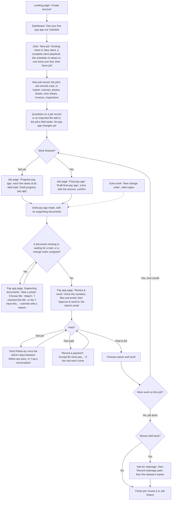
```mermaid
flowchart TD
    A["Landing page: 'Create account'"] --> B["Dashboard: 'Get your first pay app out' checklist"]
    B --> C["Jobs: 'New job': Existing client or New client, a complete client playbook, the schedule of values or one lump-sum line, then 'Save job'"]
    C --> F["New job record, the job's Job records card, or Import: contract, photos, tickets, time sheets, invoices, inspections"]
    F --> F2["Quantities on a job record or an imported file add to the job's field totals. No pay app changes yet"]
    F2 --> G{"Work finished?"}
    G -->|"Not yet"| H["Job page: 'Progress pay app': each line starts at its field total; 'Draft progress pay app'"]
    G -->|"Yes"| I["Job page: 'Final pay app', 'Draft final pay app', a box with the amount, confirm"]
    H --> J["Draft pay app made, with its supporting documents"]
    I --> J
    CO["Extra work: 'New change order', client signs"] -.-> J
    J --> K{"A document missing or waiting for a look, or a change order unsigned?"}
    K -->|"Yes"| L["Pay app page, Supporting documents: 'Take a photo', 'Choose file', 'Attach', 'I checked this file', or the 'I have this…' override with a reason"]
    L --> K
    K -->|"No"| M["Pay app page, 'Review & send': check the numbers, files and email, then 'Approve & send to' the client's email"]
    M --> N{"Paid?"}
    N -->|"Not yet"| O["'Send follow-up' once the client's days between follow-ups pass, or 'Log a conversation'"]
    O --> N
    N -->|"Part paid"| P["'Record a payment'; 'Accept $X short pay…' if the rest won't come"]
    P --> N
    N -->|"Paid in full"| Q["'Choose waiver and send'"]
    Q --> R{"More work on this job?"}
    R -->|"Yes, next month"| G
    R -->|"No, job done"| S{"Money held back?"}
    S -->|"Yes"| T["'Ask for retainage', then 'Record retainage paid', then the release's waiver"]
    S -->|"No"| U
    T --> U["'Finish job' moves it to Job history"]
```

The money loop is the middle: draft, add the supporting documents, review, send, follow up, record the payment, send the waiver, then back to next month's progress. A job usually goes round it once a month. Each step shows up on the Dashboard as a row, and in the owners' daily email, so the contractor can run the loop from the Dashboard (section 14). Duracash emails clients and only texts the company's own team (section 18).

---

## 2. First day setup

**Goal:** create the company, confirm the email, and fill in the company details that print on every pay app. The screens are the wireframes `Landing`, `CheckEmail`, `FirstRun`, `NewJob` and `Settings`.

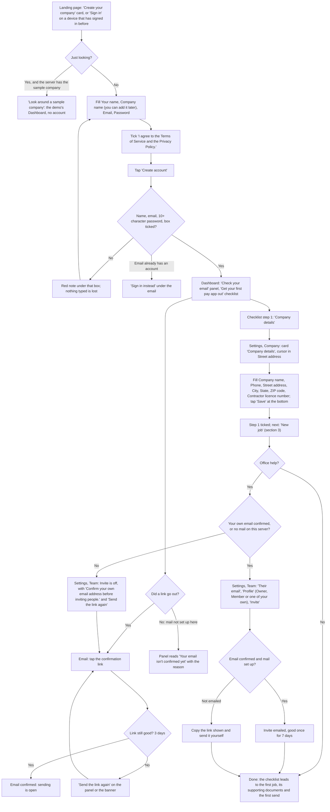
```mermaid
flowchart TD
    A["Landing page: 'Create your company' card, or 'Sign in' on a device that has signed in before"] --> A2{"Just looking?"}
    A2 -->|"Yes, and the server has the sample company"| DEMO["'Look around a sample company': the demo's Dashboard, no account"]
    A2 -->|"No"| B["Fill Your name, Company name (you can add it later), Email, Password"]
    B --> C["Tick 'I agree to the Terms of Service and the Privacy Policy.'"]
    C --> D["Tap 'Create account'"]
    D --> E{"Name, email, 10+ character password, box ticked?"}
    E -->|"No"| E1["Red note under that box; nothing typed is lost"]
    E1 --> B
    E -->|"Email already has an account"| E2["'Sign in instead' under the email"]
    E -->|"Yes"| F["Dashboard: 'Check your email' panel, 'Get your first pay app out' checklist"]
    F --> F1{"Did a link go out?"}
    F1 -->|"Yes"| G["Email: tap the confirmation link"]
    F1 -->|"No: mail not set up here"| F2["Panel reads 'Your email isn't confirmed yet' with the reason"]
    G --> H{"Link still good? 3 days"}
    H -->|"Yes"| I["Email confirmed: sending is open"]
    H -->|"No"| J["'Send the link again' on the panel or the banner"]
    J --> G
    F --> K["Checklist step 1: 'Company details'"]
    K --> L["Settings, Company: card 'Company details', cursor in Street address"]
    L --> M["Fill Company name, Phone, Street address, City, State, ZIP code, Contractor licence number; tap 'Save' at the bottom"]
    M --> N["Step 1 ticked; next: 'New job' (section 3)"]
    N --> O{"Office help?"}
    O -->|"Yes"| P0{"Your own email confirmed, or no mail on this server?"}
    P0 -->|"No"| P1["Settings, Team: Invite is off, with 'Confirm your own email address before inviting people.' and 'Send the link again'"]
    P1 --> G
    P0 -->|"Yes"| P["Settings, Team: 'Their email', 'Profile' (Owner, Member or one of your own), 'Invite'"]
    O -->|"No"| Q["Done: the checklist leads to the first job, its supporting documents and the first send"]
    P --> R{"Email confirmed and mail set up?"}
    R -->|"Yes"| S["Invite emailed, good once for 7 days"]
    R -->|"Not emailed"| T["Copy the link shown and send it yourself"]
    S --> Q
    T --> Q
```

Code: landing and sign-up card `renderLanding`, static/js/views/auth.js:45 (Sign in first when this browser has signed in, static/js/views/auth.js:11-17; the terms box static/js/views/auth.js:94); **Look around a sample company** static/js/views/auth.js:71 and `lookAround` static/js/views/auth.js:219, server `_p_demo`; "Check your email" panel `checkEmailHtml`, static/js/views/auth.js:375 (**Send the link again**, **Got it**); checklist `onboardingHtml`, static/js/views/today.js:191-235, its step 1 **Company details** opens Settings, Company at `#co-address`; Company page `companyView`, static/js/views/settings.js:204; **Save** `save-company` static/js/views/settings.js:736 (the details, the address in four boxes and the switches together, S1 and S3; the server checks each box, `update_company`); Team `teamCardHtml`, static/js/views/settings.js:83, **Invite** `team-invite` static/js/views/settings.js:651 (off, with the reason and **Send the link again**, while `inviteLocked` static/js/setup.js:41; the server still refuses, `_p_team_invite`). Two-step sign-in is on for every account (section 16).

**Taps from start to done:** about 5. Create account (1, after typing 3 boxes and the tick), the email link (1), Company details on the checklist (1, lands in the Street address box), Save (1), Invite (1, optional).

**What changed since Round 2:** Settings is four pages (Company, Team, My account, Billing) instead of one long Team & account page (R6-03); the checklist and Review & send name Settings, Company. Sign-up is limited to 5 an hour per network (R6-05). The Company page has **Sending and email** (who may send, the daily email) for owners.

**Where it could still be simpler:**
- Hiding the checklist is per person, so a teammate who joins later sees it until they hide it (it can be brought back from Settings, My account).

---

## 3. Add a job by hand

**Goal:** get a job, the client who pays it and its schedule of values into Duracash. A new job needs a complete client playbook: the client's name and type, who signs off, the billing email and a phone number. Clients can also be added on their own (section 15).

```mermaid
flowchart TD
    A["Jobs page or the Dashboard checklist: tap 'New job'"] --> IC{"Have the contract as a file or text?"}
    IC -->|"Yes"| IM["Open the fold 'Import contract' at the top ('Fill the boxes from a Word, PDF or text file'): 'Import contract' or 'Paste the contract's text', 'Read it': the boxes it finds fill in, each marked 'From the contract'"]
    IC -->|"No"| B
    IM -->|"A scanned PDF"| IS["'Couldn't read text from this file; fill the fields in by hand.'"]
    IM --> B
    IS --> B
    B["Card 'New job', required boxes first: Job name, Street address, City, State, ZIP, Contract amount, Retainage %"]
    B --> C{"'Existing client' or 'New client'? (no clients yet: New client)"}
    C -->|"Existing client"| C1["Pick from the list. A line shows the client's type, who signs off, email and phone, with 'Change in the Client playbook' (what you typed stays). Boxes appear only for what this client is missing"]
    C -->|"New client"| C2["Client name, Client type (starts on Choose…), Who signs off on your bills (starts empty), Email for pay apps, Phone"]
    C1 --> RT["Retainage % fills in with what the client usually holds: its 'Usual retainage %', else 10% for a general contractor, public agency or another subcontractor and 0% for an owner or homeowner. A figure you type stays, a 0 too"]
    C2 --> RT
    RT --> D["Then the optional boxes: Start date (today), Anticipated end date, Pay apps due by and Payment terms (a new client), Contract number, Assigned to (with a team), Notes (kept in the job records)"]
    D --> SV{"Fold 'Schedule of values' ('One lump-sum line for the contract amount'): open it and type lines?"}
    SV -->|"Yes"| SV1["Description, Qty, Unit, Unit rate $; 'Add line'. They must add up to the contract amount"]
    SV -->|"Leave it closed"| SV2["One lump-sum line for the contract amount is made"]
    SV1 --> E
    SV2 --> E["Tap 'Save job'"]
    E --> F{"Each box as the field rules say, the client complete?"}
    F -->|"No"| G["Red note under the box, for example 'Enter the email pay apps go to, like ap@builder.com.' Nothing is saved"]
    G --> B
    F -->|"An open job already has that name"| SJ["'You already have a job called (name).' with 'Open (name)' or 'Keep as a new job'. Nothing is saved yet"]
    SJ -->|"'Keep as a new job'"| H
    F -->|"Yes"| H{"Client name already known?"}
    H -->|"New client"| I["New client made with its type's default supporting documents list"]
    H -->|"Known client (same name, ignoring case)"| J["The client's settings are kept; what was asked for is saved to its playbook"]
    H -->|"Nearly the same as a saved one: 'ABC Builders Inc', 'abc builders, LLC'"| N["Under Client: 'Use ABC Builders' or 'Keep “ABC Builders Inc” as a new client'. Nothing is saved yet"]
    N -->|"'Use ABC Builders'"| J
    N -->|"'Keep “ABC Builders Inc” as a new client'"| I
    I --> K["Job page opens with its schedule of values (the contract's, when one was read and ticked); an imported contract is on its Job records as Contract"]
    J --> K
```

Code: `views.jobs`, static/js/views/jobs.js:404 (**New job**, once: with no open jobs it is the empty state's button only; the boxes, **Save job**; the required boxes come first, with Retainage % beside the contract amount because it is money, then the optional ones, Round 1 item 16); `jobFields` static/js/views/jobs.js:23 (the address as four boxes, J1, Start date, J8, and **Anticipated end date**) and its checks `jobFieldErrors` static/js/views/jobs.js:58 (on Edit job, with `savedJobFields` static/js/views/jobs.js:74, only the boxes changed from what the form opened with are checked, the address's four as one; the server's `edit_job`, domain/__init__.py:5412, does the same, so a contract number or address saved before the rules doesn't block another edit), with the field rules of static/js/validate.js (G1, checked on leaving a box by static/js/forms.js). **Existing client** and **New client** are `nj-client-mode` static/js/views/jobs.js:618, `clientMode` static/js/views/jobs.js:120; with no clients saved the form goes straight to the new client's boxes. A saved client's line is `knownPayerText` static/js/views/jobs.js:113, its boxes `payerSlotHidden` static/js/views/jobs.js:127 and `payerMissing` static/js/views/jobs.js:109, from the server's `playbook_missing`, domain/__init__.py:2964: a blank box, a client type never picked (one read from an older role isn't an answer) or a signer that only defaulted to the client's own name (`signer_defaulted`, domain/__init__.py:2957). **Client type** and **Who signs off on your bills** start blank and nothing fills them. Typing the signer in its box sends `approver_confirmed`, static/js/views/jobs.js:581, which `signer_answered`, domain/__init__.py:2949, counts as a person's answer, even when it is the client's own name; saving the card without typing it does not. **Change in the Client playbook** `nj-to-playbook` static/js/views/jobs.js:613 keeps what was typed and brings it back on return to Jobs.

**Import contract** is a fold at the top of the form, with what it does or "Filled from (file)" as its summary, open while a read is shown (`nj-import`); `contractImportHtml` static/js/views/jobs.js:256, `readContract` static/js/views/jobs.js:333 (POST /api/contract/read, server `contract_import.read`, contract_import.py:39, which reads Word files, text PDFs and pasted text and saves nothing; a PDF is read moving forward only, for at most 1.5 s, 30 MB inflated and 400,000 characters, `pdf_text` contract_import.py:173, so a small crafted file can't hold the server), `fileContract` static/js/views/jobs.js:352 (the file goes on the record as kind contract after the save). A schedule of values the read found goes with the job itself: **Save job** sends its lines as `sov_lines` in the same POST /api/jobs, and when **Use the schedule total as the contract amount** is ticked, its total as `contract_cents` (`create-job`). So whoever may create the job sets up its contract, a Member too; the `manage_jobs` gate on a schedule saved as a new contract amount (`_may_change_contract` server.py) is for changing an existing job's contract. The contract's completion date fills Anticipated end date (`fillFromContract` static/js/views/jobs.js:302). When the contract's schedule of values doesn't add up to the contract amount, the line under its checkbox says by how much and offers that box (`sovTotalChoice` static/js/views/jobs.js:286).

The schedule is asked for by `newJobSovHtml` static/js/views/jobs.js:373, a fold whose summary reads "One lump-sum line for the contract amount" or the number of lines typed, open once lines are typed (hidden when a contract read found one and it is ticked). The lines go as `sov_lines` to `create_job`, domain/__init__.py:5138: lines that don't add up to the contract are refused under the card with nothing saved (field `sov`, `_new_job_schedule` domain/__init__.py:5395), and with none the job gets the one lump-sum line. **Save job** `create-job` static/js/views/jobs.js:527. The job is made with `playbook_required`, so its pay apps wait for a complete playbook (section 15). Each box is checked again on the server by the same rules in domain/validate.py; a refusal is keyed by field and shown under its box (`showFieldErrors` in static/js/forms.js); the address is kept whole too, "Street, City, ST 12345", for the pay app PDF, the client's page and Inbox matching. Client type has five kinds: General contractor and Another subcontractor use a general contractor's defaults, Owner or developer, Homeowner and Public agency an owner's (`CLIENT_TYPES` static/js/jobs.js:608, `client_type_role` domain/jobinfo.py:32). Notes become a "Job notes" record, never a supporting document (R1-04).

Retainage % (Round 1, item 1): a new job starts at what its client usually holds, `default_retainage_pct` domain/jobinfo.py:43: the client playbook's **Usual retainage %** (`retainage_pct` on the client, 0 to 20), else `RETAINAGE_BY_TYPE` domain/jobinfo.py:40, 10% for a general contractor, a public agency and another subcontractor, none for an owner or homeowner. The client list carries it as `retainage_default` (`payer_extras` domain/jobinfo.py); the page mirrors the rule in `newJobRetainage` static/js/jobs.js:619, so the box shows the chosen client's figure, else its own type's default, or the picked client type's for a new client (or a saved one without a type): a type left in the form from another client, or read from a contract, never overrides a saved client's own (Round 1 hunt; Import contract leaves a saved client's type alone). It changes as the client or type changes (`prefillRetainage` static/js/views/jobs.js:228). Once someone types in the box, a 0 too, it is theirs and stays (`retainage_touched`). **Save job** sends what the box shows; a box left blank goes as "", and POST /api/jobs then takes the client's usual. Existing jobs keep theirs. The pay app page names a general contractor, public or lower-tier job at 0% when the client usually holds some (section 8).

A near match (Oct 23 note 5) is found by `payer_near` domain/__init__.py:3044, which compares names with `customer_key` domain/__init__.py:3029; the refusal carries `same_customer` and `showSameCustomer` static/js/views/jobs.js:146 shows the two buttons, `nj-same-use` static/js/views/jobs.js:627 and `nj-same-keep` static/js/views/jobs.js:636. A job of the same name works the same way (Round 1, item 20): `job_near` domain/__init__.py:3055 finds an open job whose name is this one, ignoring case, spacing and punctuation, the refusal carries `same_job`, and `showSameJob` static/js/views/jobs.js:160 offers **Open (name)** or **Keep as a new job** (`nj-same-job-keep` static/js/views/jobs.js:606, sent again with `new_job`). Nothing is merged without a tap.

Jobs saved before the address had four boxes keep their one line: Edit job shows it all in Street address until someone splits it (migration step `_jobs_clients_address_parts`, migrations.py:111). Jobs saved before Nov 3 have no schedule unless someone set one, keep dollar progress, and aren't held up by an incomplete playbook; sending still needs the email.

**Taps from start to done:** 3 taps (New job, Existing client or New client, Save job), 7 boxes with a complete saved client, 11 with a new one; with a contract file, two more (open Import contract, Import contract) and a check of each box.

**Where it could still be simpler:**
- The supporting documents list for a new client is set by its Client type and is changed in the Client playbook, or for one job on the job page (section 15), not on the New job form.
- Reading a contract is plain rules, not a reader of any layout: a scanned PDF, or a contract that words the sum or the parties unusually, leaves those boxes for you to fill.

---

## 4. The schedule of values

**Goal:** every new job bills from a schedule of values: quantity done drives what can be billed, and the person keeps the last word on each amount. The card is on every job page.

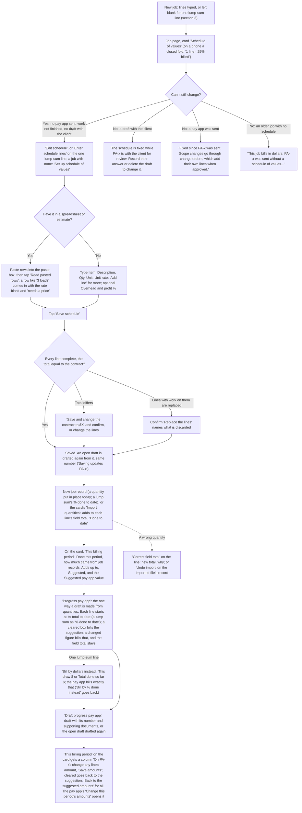
```mermaid
flowchart TD
    N["New job: lines typed, or left blank for one lump-sum line (section 3)"] --> A["Job page, card 'Schedule of values' (on a phone a closed fold: '1 line · 25% billed')"]
    A --> B{"Can it still change?"}
    B -->|"Yes: no pay app sent, work not finished, no draft with the client"| B1["'Edit schedule', or 'Enter schedule lines' on the one lump-sum line; a job with none: 'Set up schedule of values'"]
    B1 --> B2{"Have it in a spreadsheet or estimate?"}
    B2 -->|"Yes"| C["Paste rows into the paste box, then tap 'Read pasted rows'; a row like '3 loads' comes in with the rate blank and 'needs a price'"]
    B2 -->|"No"| E["Type Item, Description, Qty, Unit, Unit rate; 'Add line' for more; optional Overhead and profit %"]
    C --> G
    E --> G["Tap 'Save schedule'"]
    G --> H{"Every line complete, the total equal to the contract?"}
    H -->|"Total differs"| M["'Save and change the contract to $X' and confirm, or change the lines"]
    H -->|"Lines with work on them are replaced"| L["Confirm 'Replace the lines' names what is discarded"]
    H -->|"Yes"| K["Saved. An open draft is drafted again from it, same number ('Saving updates PA-x')"]
    M --> K
    L --> K
    B -->|"No: a draft with the client"| B3["'The schedule is fixed while PA-x is with the client for review. Record their answer or delete the draft to change it.'"]
    B -->|"No: a pay app was sent"| B4["'Fixed since PA-x was sent. Scope changes go through change orders, which add their own lines when approved.'"]
    B -->|"No: an older job with no schedule"| B5["'This job bills in dollars: PA-x was sent without a schedule of values…'"]
    K --> F1["New job record (a quantity put in place today; a lump sum's % done to date), or the card's 'Import quantities': adds to each line's field total, 'Done to date'"]
    F1 --> P["On the card, 'This billing period': Done this period, how much came from job records, Adds up to, Suggested, and the Suggested pay app value"]
    F1 -.->|"A wrong quantity"| FX["'Correct field total' on the line: new total, why; or 'Undo import' on the imported file's record"]
    P --> D["'Progress pay app': the one way a draft is made from quantities. Each line starts at its total to date (a lump sum as '% done to date'); a cleared box bills the suggestion; a changed figure bills that, and the field total stays"]
    D -.->|"One lump-sum line"| DD["'Bill by dollars instead': This draw $ or Total done so far $; the pay app bills exactly that ('Bill by % done instead' goes back)"]
    DD --> DR
    D --> DR["'Draft progress pay app': draft with its number and supporting documents, or the open draft drafted again"]
    DR --> AM["'This billing period' on the card gets a column 'On PA-x': change any line's amount, 'Save amounts'; cleared goes back to the suggestion; 'Back to the suggested amounts' for all. The pay app's 'Change this period's amounts' opens it"]
```

Code: asked at New job, section 3. Card `sovCardHtml`, static/js/views/job-sov.js:178 (**Set up schedule of values**, **Edit schedule** or **Enter schedule lines** by `v.auto`; a fold with `sovSummary` static/js/views/job-sov.js:162 as its line, closed on a phone, Round 1 item 13: "1 line · 25% billed", or "1 line · 25% on the draft" while only a draft holds it, from each line's `sent_cents`); editor `sovEditorHtml`, static/js/views/job-sov.js:81 (**Read pasted rows**, **Add line**, **Save schedule**, **Save and change the contract to $X** `updateSovTotals` static/js/views/job-sov.js:57, its confirm in `sovSave` static/js/views/job-sov.js:239, and **Replace the lines**, from `sovLostLines` static/js/sov.js:51); parse `sov.parse_rows`, sov.py:758 (a header found in the first 5 rows, R5-08; one number next to a unit word in `UNIT_WORDS` sov.py:636 is a quantity with no price, sent back with `needs_price` and a blank rate); save `save_sov`, domain/__init__.py:5610, which refuses a blank rate. A schedule that doesn't total the contract is refused; for someone without `manage_jobs` the refusal says changing the contract amount takes someone who can change a job's contract, instead of offering it (`may_change_contract`).

The lock rules are `_sov_view`, domain/__init__.py:6412: `editable` until the first pay app is sent (a draft doesn't lock it, Nov 3 Decision 2), not while a draft is with the client for review, not once the work is finished or the job closed. The card says why in `sovFixedNote` static/js/sov.js:85, with **Delete draft** for whoever may delete drafts in `sovDraftLockHtml` static/js/sov.js:73. A job with a sent pay app and no schedule bills in dollars and says so. While nothing is billed on the automatic line, the Edit job form can still change the contract amount (`contract_follows`, `_contract_follows` domain/__init__.py:6322).

Field totals and billing are apart. A New job record's quantities and an imported file add to the line's field total (`add_field_quantities`, domain/daily.py:548; a New job record asks a lump sum's % done to date and adds the step up from the field total, section 17), shown as **Done to date** beside **Earned to date**, **Billed** and **Balance to finish**; nothing they do makes or changes a draft. A record that can't add (the draft is with the client, the job is marked done, a line would go past its scheduled quantity) is saved anyway with `quantities_not_applied` saying why. The only ways to a draft from quantities are **Progress pay app**, `sovProgressHtml` static/js/sov.js:160 and `record_sov_progress`, domain/__init__.py:5721 (a lump-sum line's box reads **% done to date**), and **Final pay app**, which sets every line to 100%. A job on one lump-sum line also gets **Bill by dollars instead** (Round 1, item 10; `oneLumpLine` static/js/jobs.js:327): the older jobs' dollar form (**This draw $** or **Total done so far $**), with the live line "This pay app: $A less retainage $R = $N."; `lumpDollars` static/js/jobs.js:337 turns the dollars into the line's % done (rounded down to a tenth of a percent), and the request sends the exact dollars as the line's amount, so `_sov_progress` server.py:3244 records the progress and bills that amount in one request (a refused amount leaves no draft). A draw smaller than a tenth of a percent ($5 on a $10,000 line) steps the line up to the next tenth that holds it and still bills exactly the dollars (`done_for_amounts` domain/__init__.py:5819); a new dollar amount on the open draft at the same quantities changes only its amounts instead of being refused as already drafted (`drafted_at` domain/__init__.py:5848). **Bill by % done instead** goes back. A % typed later on a line whose amount was changed by hand is the newer entry: the amount gives way to it, and the activity log says "the $X changed by hand gives way to it" (Round 1 hunt). The form starts each line from `form_done_milli`, `_progress_form_figure` domain/__init__.py:6403 (the field total, or the open draft's own typed figure). A blank box is the suggestion; a figure typed that differs from the field total is the person's own, audited with the suggested and final figures, and the field total stays as it was. With nothing recorded and nothing typed it refuses, "Enter the quantity completed to date on at least one line."

The period card is `sovPeriodHtml`, static/js/sov.js:108, from `_sov_period`, domain/__init__.py:6349: everything recorded and not yet on a sent pay app, late records included; shown on the schedule card, where its amounts change, and on the progress form. The pay app page no longer carries it: under **Show the numbers** its Lines card has **Change this period's amounts**, which opens the job at the schedule card (Round 1, item 4). **Save amounts** `sov-amounts`, **Back to the suggested amounts** `sov-amounts-reset`, static/js/views/job-sov.js:339, server `set_payapp_amounts`, domain/__init__.py:708 (the draft is drafted again, same number and supporting documents; any amount from $0 to what is left on the line; each change audited as "Pay app amount changed"; refused while the draft is with the client).

**Correct field total** is `sovCorrectHtml`, static/js/views/job-sov.js:128, server `correct_field_total`, domain/__init__.py:5902: the new total and why it was wrong, with a confirm that warns when it goes below what sent pay apps billed (they stay as they are, and nothing more is suggested until the field total passes that), and the old and new totals in the activity log. **Undo import** on an imported file's record, `quantities-undo` static/js/views/job-record.js:110, server `undo_quantity_import`, domain/__init__.py:5948, takes off what that file added and keeps the record, saying so. Both go through `_field_totals_change`, domain/__init__.py:5870: an open draft drafted at the old field total follows, unless it is with the client, and a figure typed on a draft stays until the person changes it. **Import quantities** is on the schedule card (`qtyImportForJob` static/js/views/data.js:76, Round 1 item 19): a CSV or Excel file, or rows pasted, a preview row by row, and **Add N to the schedule of values** for the rows that can go on (under Flows not charted). Import/Export no longer has the Quantities done and Schedule of values cards; the schedule is set on the job.

On a phone each line is a card with the description on top (R6-02).

**Taps from start to done:** none if the schedule is the lump-sum line or was typed at New job. Later, 3 with a paste (Edit schedule, Read pasted rows, Save schedule), one more (the confirm) if the contract changes to match. Billing: 2 (Progress pay app, Draft progress pay app).

**Where it could still be simpler:**
- A lump-sum line's % done takes one decimal; on a job with more than one line, a dollar figure that isn't a tenth of a percent is reached by changing the amount on the draft (a one-line job has Bill by dollars instead).
- A mistake found after the first pay app is sent means a change order.

---

## 5. Import existing documents

**Goal:** get contracts, photos, tickets, emails and old notes onto the right job without retyping. For what happened on site today, use New job record (section 17).

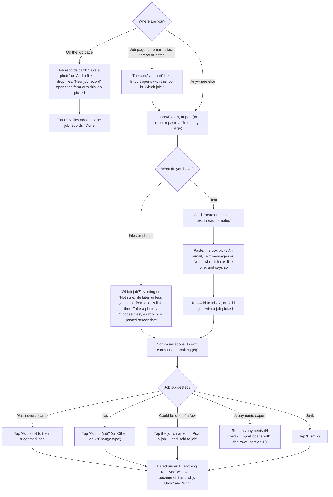
```mermaid
flowchart TD
    A{"Where are you?"} -->|"On the job page"| B["Job records card: 'Take a photo' or 'Add a file', or drop files. 'New job record' opens the form with this job picked"]
    B --> C["Toast: 'N files added to the job records.' Done"]
    A -->|"Job page, an email, a text thread or notes"| B2["The card's 'Import' link: Import opens with this job in 'Which job?'"]
    B2 --> D
    A -->|"Anywhere else"| D["Import/Export, Import (or drop or paste a file on any page)"]
    D --> E{"What do you have?"}
    E -->|"Files or photos"| F["'Which job?', starting on 'Not sure, file later' unless you came from a job's link, then 'Take a photo' / 'Choose files', a drop, or a pasted screenshot"]
    E -->|"Text"| G["Card 'Paste an email, a text thread, or notes'"]
    G --> H["Paste: the box picks An email, Text messages or Notes when it looks like one, and says so"]
    H --> K["Tap 'Add to Inbox', or 'Add to job' with a job picked"]
    F --> L["Communications, Inbox: cards under 'Waiting (N)'"]
    K --> L
    L --> M{"Job suggested?"}
    M -->|"Yes, several cards"| N["Tap 'Add all N to their suggested jobs'"]
    M -->|"Yes"| O["Tap 'Add to (job)' (or 'Other job' / 'Change type')"]
    M -->|"Could be one of a few"| P["Tap the job's name, or 'Pick a job…' and 'Add to job'"]
    M -->|"A payments export"| PAY["'Read as payments (N rows)': Import opens with the rows, section 10"]
    M -->|"Junk"| Q["Tap 'Dismiss'"]
    N --> R["Listed under 'Everything received' with what became of it and why, 'Undo' and 'Print'"]
    O --> R
    P --> R
    Q --> R
```

Code: Job records card `recordCardHtml`, static/js/views/job-record.js:85 (**New job record**, **Take a photo** / **Add a file** `pick-files` static/js/views/inbox.js:457, the Import link `import-for-job` static/js/views/inbox.js:475); record rows with **Edit** `recordRow` static/js/views/job-record.js:21 (R5-07), in groups with their counts and a filter row (`recordGroupsHtml` static/js/views/job-record.js:71, `RECORD_GROUPS` static/js/jobs.js:691: Contract and change orders, Diary entries, Delivery tickets, Progress photos, Time sheets, Tickets, Invoices, Inspections, Stored materials, Lien waivers, Insurance and certificates, Closeout, Pay app backup, Conversations, Notes and other). Import `views.import`, static/js/views/data.js:110 (the file box `dropzoneHtml` static/js/views/inbox.js:169 with **Which job?**, `uploadJobOptions` static/js/views/inbox.js:153, and the touch-only **Take a photo** / **Choose files**, the paste box `pasteBoxHtml` static/js/views/inbox.js:188, the payments import of section 10; quantities are imported on the job's schedule card, section 4); Inbox `views.inbox`, static/js/views/inbox.js:424 (**Waiting (N)**, a phone's **Take a photo**, **Everything received**, **Bring emails and texts in automatically**); **Everything received** `receivedHtml` static/js/views/inbox.js:269 (Received, From, Subject with the files, Came in by, Status in words `receivedStatus` static/js/views/inbox.js:241 with how it was matched; filters **Came in by**, **Status**, **Job** and **Sort** `setReceivedFilter` static/js/views/inbox.js:223, each label kept with its box, one per row on a phone (D5, `receivedSelect` static/js/views/inbox.js:260); **Undo**, **Print** `print-received` static/js/views/inbox.js:535), paged by the server `GET /api/inbox` (`_g_inbox_page` server.py:1262, `domain.inbox_page` domain/comms.py:78, the reason in words `_why` domain/comms.py:46); the page load carries only what waits and the last 20 others (`inbox_for_page_load` domain/comms.py:25); cards `inboxItemCard` static/js/views/inbox.js:292 with `choiceJobs` / `choiceLine` / `pasteGuess` in static/js/inbox.js; a ticket is offered as **Delivery ticket** or **Time sheet**, `FILE_KINDS` and `fileKindPick` static/js/jobs.js:21, filed as `ticket:delivery` or `ticket:time_sheet` by `file_item` importer.py:650; uploads three at a time `uploadFiles` static/js/views/inbox.js:34; server matching `importer.match_job`, importer.py:471 (a job code in capitals, or in small letters as its own word when no job's name or address has that word; the full job name or a part of it no other job has, like Oak Street for Oak Street kitchen, or one telling word written with a capital, like Vesta; a code in small letters or one name word counts less than the client's AP email; a tie suggests nothing), kinds `guess_kind` importer.py:391, notes split `split_notes` importer.py:362; **Undo** `undo_item` importer.py:804, refused while a pay app's supporting documents use the record by `_paperwork_refusal` importer.py:757, with a link in the refusal card (`showRefusal` static/js/app-core.js:359).

**Taps from start to done:** 2 from the job page (Take a photo or Add a file, pick). From Import: 2 to add, then 1 per card in the Inbox to file, or 1 for all suggested cards.

**Where it could still be simpler:**
- Forwarding email and texts in needs an email service or a Twilio number set up by an owner (deferred: a provisioned address per company, improvement plan section 5).
- Once a record is attached by hand to a pay app's supporting documents, Undo on the Inbox is refused. For a draft it links to that pay app's page, where Remove is. For a pay app that went out it links to the pay app: the record stays as sent, and pulling the pay app back (only while nothing is paid) is the way to change what went out.

---

## 6. Change order

**Goal:** record extra work (or a credit) with its reason and price, get it signed, and bill it.

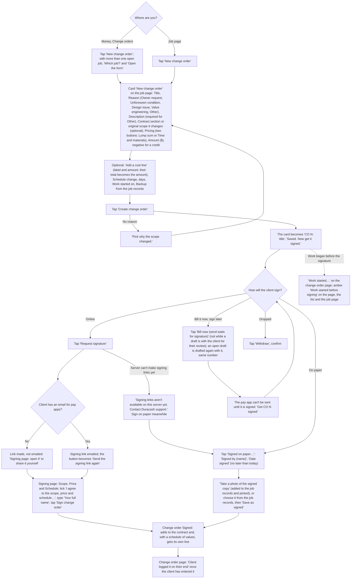
```mermaid
flowchart TD
    A{"Where are you?"} -->|"Job page"| A1["Tap 'New change order'"]
    A -->|"Money, Change orders"| A2["Tap 'New change order'; with more than one open job, 'Which job?' and 'Open the form'"]
    A2 --> B
    A1 --> B["Card 'New change order' on the job page: Title, Reason (Owner request, Unforeseen condition, Design issue, Value engineering, Other), Description (required for Other), Contract section or original scope it changes (optional), Pricing (two buttons: Lump sum or Time and materials), Amount ($), negative for a credit"]
    B --> B2["Optional: 'Add a cost line' (label and amount; their total becomes the amount), Schedule change, days, Work started on, Backup from the job records"]
    B2 --> D["Tap 'Create change order'"]
    D -->|"No reason"| D2["'Pick why the scope changed.'"]
    D2 --> B
    D --> E["The card becomes 'CO N: title', 'Saved. Now get it signed.'"]
    E --> F{"How will the client sign?"}
    F -->|"Online"| G["Tap 'Request signature'"]
    G -->|"Server can't make signing links yet"| G2["'Signing links aren't available on this server yet. Contact Duracash support.' Sign on paper meanwhile"]
    G2 --> L
    G --> H{"Client has an email for pay apps?"}
    H -->|"Yes"| I["Signing link emailed; the button becomes 'Send the signing link again'"]
    H -->|"No"| J["Link made, not emailed: 'Signing page: open it' to share it yourself"]
    J --> K
    I --> K["Signing page: Scope, Price and Schedule; tick 'I agree to the scope, price and schedule…', type 'Your full name', tap 'Sign change order'"]
    F -->|"On paper"| L["Tap 'Signed on paper…': 'Signed by (name)', 'Date signed' (no later than today)"]
    L --> M["'Take a photo of the signed copy' (added to the job records and picked), or choose it from the job records, then 'Save as signed'"]
    F -->|"Bill it now, sign later"| N["Tap 'Bill now (send waits for signature)' (not while a draft is with the client for their review): an open draft is drafted again with it, same number"]
    N --> O["The pay app can't be sent until it is signed: 'Get CO N signed'"]
    O --> F
    F -->|"Dropped"| P["Tap 'Withdraw', confirm"]
    K --> Q["Change order Signed: adds to the contract and, with a schedule of values, gets its own line"]
    M --> Q
    Q --> R["Change order page: 'Client logged it on their end' once the client has entered it"]
    E -.->|"Work began before the signature"| W["'Work started…' on the change order page; amber 'Work started before signing' on the page, the list and the job page"]
```

Code: **New change order** `new-co` static/js/views/job-cos.js:168 (a job action, static/js/jobs.js:510); card `newCoCardHtml` static/js/views/job-cos.js:77 and `coFormFields` static/js/views/job-cos.js:95 (**Add a cost line** `co-add-item` :168); **Create change order** `add-co-here` static/js/views/job-cos.js:176, checked first in `addChangeOrder`; server `_add_co` server.py:3184 and `add_change_order` :3179 (reasons `CO_REASONS` domain/__init__.py:3366; refuses a missing reason, Other without a description, more than 50 cost lines, an amount that differs from the cost lines, backup not on this job's record, a start day in the future, zero, and a credit larger than the contract total). On Money, Change orders (`views.cos`, static/js/views/changeorders.js:99) the list has no form: **New change order** `co-new` :185 opens the job's form straight away when only one job is open, else asks **Which job?** and **Open the form** `co-new-open` :192. Sign controls `coSignControls` static/js/views/job-cos.js:46 (**Request signature**, for anyone; **Signed on paper…** with **Signed by (name)** and **Date signed**, and **Withdraw**, only for those with `manage_jobs`, section 16; **Take a photo of the signed copy**, **Save as signed** `approve-co` static/js/views/changeorders.js:199); server `request_co_signature` domain/__init__.py:3608 (without the site address it refuses with `NO_SIGNING_LINKS`, :3598, and the server log names DURACASH_URL, `_request_co_signature` server.py:3205), `mark_co_signed` :2331 (needs the signer's name and a date no later than today; signing, online or on paper, takes "(unsigned)" off the line of an open draft that billed it, so the PDF no longer says so), `withdraw_change_order` :3468; **Bill now (send waits for signature)** in `views.job` (static/js/views/job.js:265; `manage_jobs` too), server `include_change_order`, domain/__init__.py:3958 (an open draft still only here is drafted again with the CO on it, same number; one with the client for their review is refused); signing page `render_co`, payer_page.py:311 (Scope, Price and Schedule from `co_snapshot`, :291, version 2; an older signature keeps its own snapshot and hash). The change order page `views.coDetail`, static/js/views/changeorders.js:85: Summary (reason, cost lines, pricing, schedule, work started, Waiting on), **Client logged it on their end** `co-logged` :214 (server `mark_co_logged`, domain/__init__.py:3770, only once signed), **Work started…** `co-work-started` server.py:3486 (server `set_co_work_started` :3466; the flag is `co_started_unsigned` domain/__init__.py:3729), Backup, the Contract sum card `coContractHtml` static/js/views/changeorders.js:55 ("if signed" while unsigned, counting every change order signed so far; a signed one counts those signed before it by signing day, `coSignedOn` :44) and History `coHistoryHtml` :30 (created, put on the bill, signature requested, signed, withdrawn, taken off a deleted draft, work started, client logged it, each with who and when; older change orders get theirs from the job's audit rows, migrations.py `_payapps_cos_co_history`).

**Taps from start to done:** 2 to create (New change order, Create change order) after typing, then 1 for online signing (Request signature) or 3 on paper (Signed on paper…, Take a photo of the signed copy, Save as signed).

**Where it could still be simpler:**
- A change order has no PDF of its own yet (improvement plan section 5).
- A change order can't be edited once made; withdraw it and make a new one.

---

## 7. Supporting documents and blockers

**Goal:** get every required document in, for real, so the pay app can be sent. An item clears on a real file a person has checked, not on a title. Supporting documents are part of the pay app: the job page's buttons land on the pay app's page, at the item.

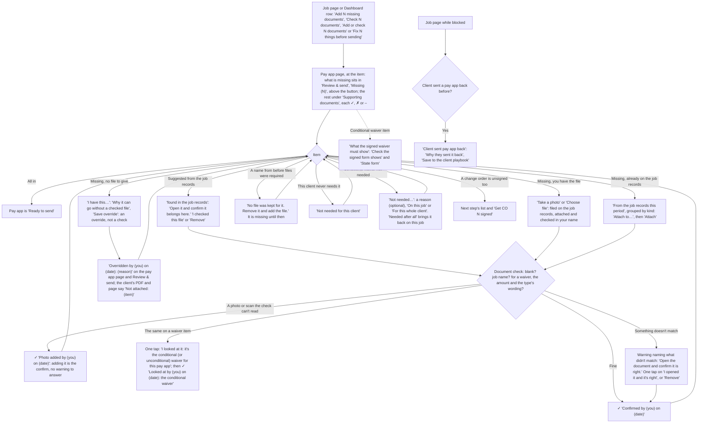
```mermaid
flowchart TD
    A["Job page or Dashboard row: 'Add N missing documents', 'Check N documents', 'Add or check N documents' or 'Fix N things before sending'"] --> B["Pay app page, at the item: what is missing sits in 'Review & send', 'Missing (N)', above the button; the rest under 'Supporting documents', each ✓, ✗ or –"]
    B --> C{"Item"}
    C -->|"All in"| D["Pay app is 'Ready to send'"]
    C -->|"Suggested from the job records"| S["'found in the job records': 'Open it and confirm it belongs here.' 'I checked this file' or 'Remove'"]
    S --> DC
    C -->|"Missing, you have the file"| F["'Take a photo' or 'Choose file': filed on the job records, attached and checked in your name"]
    C -->|"Missing, already on the job records"| G["'From the job records this period', grouped by kind: 'Attach to…', then 'Attach'"]
    F --> DC{"Document check: blank? job name? for a waiver, the amount and the type's wording?"}
    G --> DC
    DC -->|"Fine"| OK["✓ 'Confirmed by (you) on (date)'"]
    DC -->|"A photo or scan the check can't read"| PH["✓ 'Photo added by (you) on (date)': adding it is the confirm, no warning to answer"]
    DC -->|"The same on a waiver item"| PW["One tap: 'I looked at it: it's the conditional (or unconditional) waiver for this pay app'; then ✓ 'Looked at by (you) on (date): the conditional waiver'"]
    PH --> C
    DC -->|"Something doesn't match"| W["Warning naming what didn't match: 'Open the document and confirm it is right.' One tap on 'I opened it and it's right', or 'Remove'"]
    W --> OK
    C -->|"Missing, no file to give"| H["'I have this…': 'Why it can go without a checked file', 'Save override': an override, not a check"]
    H --> OV["'Overridden by (you) on (date): (reason)' on the pay app page and Review & send; the client's PDF and page say 'Not attached: (item)'"]
    C -->|"A name from before files were required"| NO["'No file was kept for it. Remove it and add the file.' It is missing until then"]
    C -->|"This client never needs it"| I["'Not needed for this client'"]
    C -->|"Conditional waiver not needed"| I2["'Not needed…': a reason (optional), 'On this job' or 'For this whole client'. 'Needed after all' brings it back on this job"]
    OK --> C
    OV --> C
    NO --> C
    I --> C
    I2 --> C
    C -->|"A change order is unsigned too"| J["Next step's list and 'Get CO N signed'"]
    B -.->|"Conditional waiver item"| WV["'What the signed waiver must show': 'Check the signed form shows' and 'State form'"]
    T0["Job page while blocked"] --> K{"Client sent a pay app back before?"}
    K -->|"Yes"| L["'Client sent pay app back': 'Why they sent it back', 'Save to the client playbook'"]
```

Code: the blocker button's words `domain.blocker_button`, domain/__init__.py:357, the lines `_blocker_text` domain/__init__.py:315 and `blocker_items` domain/__init__.py:323. The buttons land by `openSupportingDocs`, static/js/views/paperwork.js:440: the pay app's page, scrolled to the item with focus on it (`item_id`, `packet_item_id` on the Dashboard's row). Closeout, and an older job with no pay app yet, keep their own page, `views.packetDetail`, static/js/views/paperwork.js:456, which also shows **Also blocking send**. On a draft's page the missing items are inside Review & send, above **Approve & send**, as **Missing (N)** (`missingDocsHtml` static/js/views/paperwork.js:405, Round 1 item 4), with **Take a photo** and **Choose file**; `supportingDocsHtml` static/js/views/paperwork.js:417 draws the rest under **Supporting documents**, and all of them once the pay app has gone, `packetItemsHtml` static/js/views/paperwork.js:352 (each attached record with its kind, its files as links and photos as small pictures, and who attached it when, `attachmentRow` static/js/views/paperwork.js:133, `recordFileLinks` static/js/views/paperwork.js:29), and **From the job records this period** `periodHtml` static/js/views/paperwork.js:201 (the records after the previous pay app's period, grouped; **Attach to…** lists only the missing items that take that kind of record, plus **Send with the pay app**).

A real file: `_can_fill`, domain/__init__.py:4625, needs a stored, non-empty file of a type a person can open (`DOCUMENT_TYPES`; a lien waiver, contract, insurance certificate or completion certificate can't be a spreadsheet, `DOCUMENTS_ONLY`). A note fills only an item whose label asks for a note. `attach_record_to_packet`, domain/__init__.py:5089, refuses a record with no file: "(record) has no file. (item) needs the document itself, not a note." Attaching and confirming are one step for the person doing it, so the item clears with their name and the date (`_clear_item`, domain/__init__.py:4685, `confirmed_by`), unless the document check has something to say.

Suggestions: `_attach_from_record`, domain/__init__.py:4558, looks through the job records, and what fits an item is attached with `auto` and `unconfirmed`, so it doesn't clear until a person taps **I checked this file** (`confirmHtml` static/js/views/paperwork.js:337, `packet-confirm` static/js/views/paperwork.js:497, server `confirm_packet_item`, domain/__init__.py:4819). A record a person took off (`detached_record_ids`) isn't suggested again.

Document checks: doc_check.py, `check` doc_check.py:397, reads PDF, Word and text files, never OCR. A file that is blank, or that can't be opened, is flagged. With text, it looks for the job's name; for a lien waiver also the amount and the type's wording (`_type_problems` doc_check.py:369: "It says unconditional, not conditional." for a file that is an unconditional waiver, "It mentions an unconditional waiver. Check this is the conditional one." for a conditional form that talks about one, "Final wording not found."). Every flag is a warning for a person to clear, never a hard block: one tap on **I opened it and it's right**, with no second box, and the warning stays shown beside who confirmed it (Round 1, item 3; `packet-confirm` reads the file again first, and a mismatch the page wasn't showing yet is shown for its own tap). A first attach never clears a flag. Whatever goes wrong while reading is itself a warning. The reading happens before the company's lock (`_read_ahead` server.py:3395).

A photo or scan the check can't read has nothing to compare, so a person adding it is the confirm: the item reads **Photo added by (name) on (date)** (or **Added by … · it couldn't be read** for another file), `unread` on the item (`_clear_item` domain/__init__.py:4685), and its audit row says nothing was compared. On a waiver item (conditional or unconditional) it isn't in until one tap says which waiver it is, **I looked at it: it's the conditional waiver for this pay app** (`waiver_look_words` domain/__init__.py:4755, `waiverLookWords` static/js/views/paperwork.js:300), kept as `looked_as` with who and when and read back as **Looked at by (name) on (date): the conditional waiver** (Round 1 acceptance, item 14); the owner gate still applies to a record typed unconditional. A file the app put on an item from the job records reads **Suggested from the job records**, never "added by duracash". A flagged mismatch still waits for the person's look, and a look asked for on the same files (a new amount, the other waiver type) isn't answered by adding them again.

One look clears a file: the page's first read lists every problem at once and says whether it is a mismatch (`recheck_packet_item`, domain/__init__.py:4798, `check_status`), and one **I opened it and it's right** clears them all for that file at that amount (`_clear_item`, domain/__init__.py:4685, `confirming`), even if the check finds something more by then. A newer file, or a new amount, asks again. Confirm carries what the page was showing (`shown`, `_shown` server.py:3291): a Confirm refused for a file added since says so on the page and asks nothing about a file nobody looked at. Field documents (daily tickets, time sheets and the like, `FIELD_RECORD_KINDS`, domain/__init__.py:4641) don't need the job name, since field paperwork often doesn't say it; the other checks still apply.

**I have this…** stays as an override, `resolve_packet_item`, domain/__init__.py:861: it needs a reason ("Enter why (item) can go without a checked file."), and who, when and why are kept on the item and in the activity log ("Override: I have this"). They show on the pay app page, in Review & send's **Overrides**, and on Pay apps' column as **Complete, overridden**. The client's page, the PDF and the email's checklist say **Not attached: (item)** instead of a tick (payer_page.py:171, payapp_pdf.py:391).

Name-only: `sov.name_only`, sov.py:237, finds an item in only on names, from before files were required (nothing attached has a file behind it). On a pay app not sent yet it counts as missing, `missing_packet` domain/__init__.py:296, whatever older code stored; a pay app already sent stays as it went.

Not needed: `skip_packet_item`, domain/__init__.py:4902 takes an item off the client's list, or off the job's own list when it has one (`job_paperwork`). A closeout item comes off this job only. A conditional waiver comes off this job unless **For this whole client** is tapped, which keeps it off on the client, `waiver_not_needed`. **Needed after all**, `skippedHtml` static/js/views/paperwork.js:313 and `jobPaperworkHtml` static/js/views/job-paperwork.js:26, server `waiver_needed_after_all`, domain/__init__.py:4338, brings it back on this job; what was marked for the whole client is changed in the Client playbook, with **Needed after all** on the client's card (`client_waiver_needed_again`, domain/__init__.py:4349, section 15).

Who it reaches (`_skip_item`, server.py:3297): a client's rule or list is the client's settings, so **For this whole client** and **Not needed for this client** take the company permission (section 15). Without it, an item comes off this pay app only, as **Not needed on this pay app** (`skipped_scope`), and the client's list stays; the conditional waiver can still be marked **On this job**.

Server: the standard items `PAPERWORK_ITEMS`, domain/__init__.py:4459; a new pay app's list `_new_packet` domain/__init__.py:4197 (the job's own list, else the client's, else the default one, and always a conditional waiver named by its type, unless marked as not needed; an item of the list naming an unconditional waiver is that type and never filled by a conditional one); daily tickets when the pay app bills a change order or a unit-price line `_add_ticket_item` domain/__init__.py:4388; closeout documents for every job at Final pay app `_ensure_closeout_packet` domain/__init__.py:4160; `detach_packet_item` domain/__init__.py:4865 (**Remove**: the records stay on the job, and one suggested automatically isn't suggested again); attach, skip and override are refused once the pay app has gone to the client (`_still_a_draft` domain/__init__.py:4895); `set_waiver_type` domain/__init__.py:1521, `link_record_to_work` domain/__init__.py:6291; **Client sent pay app back** in `views.job`, static/js/views/job.js:265, `learn_rejection` domain/__init__.py:3991. A pay app, schedule of values or continuation sheet item is in from the start ("Produced by Duracash with the pay app"). A notarized pay application comes back from a notary, so it is its own item (`NOTARIZED_RE` domain/__init__.py:4450).

**Taps from start to done:** 1 to open, then 2 per missing item (Take a photo, take it) or 2 to attach a record (pick, Attach), plus 1 if a warning needs a look.

**Where it could still be simpler:**
- A scanned document can't be read without OCR, so nothing on a scan or photo is compared: it is in on the word of the person who added it (see Limits and open questions).

---

## 8. Draft, check and send a pay app

**Goal:** turn work done into a pay app, look over everything that goes, and email it with its PDF and supporting documents.

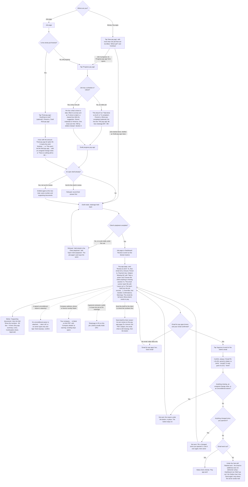
```mermaid
flowchart TD
    A0{"Where are you?"} -->|"Job page"| A["Job page"]
    A0 -->|"Money, Pay apps"| A1["Tap 'New pay app'; with more than one job that can be billed, 'Which job?' and 'Continue'"]
    A1 -->|"Job in progress: its 'Progress pay app' form opens"| C
    A1 -->|"Job marked done: drafted as 'Draft pay app' does"| L
    A --> B{"Is the whole job finished?"}
    B -->|"No, bill progress"| C["Tap 'Progress pay app'"]
    C --> D{"Job has a schedule of values?"}
    D -->|"Yes, every new job"| F["Per line: what is done to date, filled in (a lump sum as '% done to date'); a cleared box bills the suggestion. Stored materials $. Period to. One lump-sum line: 'Bill by dollars instead'. Section 4"]
    D -->|"No, an older job"| E["'This draw $' (or 'Total done so far $' or '% complete'), Period to, What was completed (optional); the live line 'This pay app: $A less retainage $R = $N.'"]
    E --> G["'Draft progress pay app'"]
    F --> G
    B -->|"Yes"| H["Tap 'Final pay app': 'Anything to note? (optional)', Period to, 'Draft final pay app'"]
    H --> H1["A box with the amount: 'Final pay app for (job): $X. It marks the work finished…'; or 'This won't be the final pay app…' with an unsigned change order; or 'There is nothing left to bill…'"]
    G --> J{"An open draft already?"}
    H1 --> J
    J -->|"Yes, not out for review"| K["Drafted again at the new total, same number and supporting documents"]
    J -->|"Out for the client's review"| K2["Refused: record their answer first"]
    J -->|"No"| L["Draft made, retainage held back"]
    K --> L
    L --> PB{"Client's playbook complete?"}
    PB -->|"No, on a job made under the rule"| PB1["Refused: 'Add (what) in the Client playbook', with 'Open Client playbook'. The job page's card says the same"]
    PB1 --> L
    PB -->|"Yes"| O["Job page or Dashboard: 'Review & send' (or the blocker button)"]
    O --> P["Pay app page, card 'Review & send': To, Also email (CC), Amount, Period to, Payment due, Subject; 'Missing (N)' with 'Take a photo' and 'Choose file' while anything is missing (section 7); 'The email carries' (each file with 'Leave out' or 'Put back', 'Add from the job records…'); Overrides; Not needed; Confirmations; Warnings; The email (its full text); What (client) needs to pay"]
    P --> P0["Below: 'Supporting documents', then the fold 'Show the numbers · $X due · N lines' (Pay app summary, Lines, Continuation sheet, Approval)"]
    P -.->|"A signed unconditional waiver is attached"| PU["'An unconditional waiver is attached…': take it off, or an owner types why and taps 'Send anyway', confirm"]
    P -.->|"Company address, phone or licence number blank"| PW["'Your company … is blank on this PDF.' with 'Company details' (a warning: sending stays open)"]
    P -.->|"A general contractor, public or lower-tier job at 0% retainage"| PR["'Retainage is 0% on this job. (client) usually holds 10%.'"]
    P -.->|"Send the draft for the client to check the numbers first"| PN["'Send draft for their review': its own review on the pay app page (To, Amount, the PDF, Subject, the email, what is still missing), then the button"]
    P --> P1{"Email for pay apps known and your email confirmed?"}
    P1 -->|"No email: older data only"| P2["'Email for pay apps' box, 'Save email'"]
    P2 --> P
    P1 -->|"Yes"| Q["Tap 'Approve & send to' the client's email"]
    Q --> QC["Confirm, always: 'Email PA-x for $X, period to (date), to (who) · (email)? A copy goes to (CC).' 'Send'"]
    QC --> QM{"Anything missing, an unsigned change order, or an unconditional waiver?"}
    QM -->|"Yes"| QR["Not sent: the reason under the button, in place. The button stays on"]
    QR --> P
    QM -->|"No"| Q1{"Anything changed since you opened it?"}
    Q1 -->|"Yes"| Q2["Not sent: 'PA-x changed since you opened it. Look it over again, then send.'"]
    Q2 --> P
    Q1 -->|"No"| R{"Email went out?"}
    R -->|"Yes"| S["Status Sent; Activity: 'Pay app sent'"]
    R -->|"No"| T["Under the Sent pill: 'Marked sent · the email to (address) was not delivered: (why).' Dashboard row 'Didn't go out'; the Outbox has it too. 'Send again' only where the server sends mail"]
```

Code: **Progress pay app** and **Final pay app** in `jobActions`, static/js/jobs.js:464 (Final pay app takes `manage_jobs`, section 16); on Money, Pay apps (`views.payapps`, static/js/views/payapps.js:224) **New pay app** `payapp-new` static/js/views/payapps.js:289 lists only the jobs `payAppStarts` (static/js/jobs.js:646) finds the job page would offer **Draft pay app** or **Progress pay app** on, to this person (`mayTake`), and opens that job's own step, `startPayApp` static/js/views/payapps.js:270, so there is one way of drafting; older jobs' progress card `progressFormHtml`, static/js/views/job.js:112 (`progressFigures`, static/js/jobs.js:277, checks it as the server does); line-by-line card `sovProgressHtml` static/js/sov.js:160 (it names an open draft it replaces, which keeps its number and supporting documents; a lump-sum line's **% done to date** takes at most one decimal, `lumpDone` static/js/sov.js:34, never rounded). Final pay app's box asks `GET /api/jobs/<id>/final-preview` first (`done` static/js/views/job.js:435, `final_pay_app_preview` domain/__init__.py:541) and words it in `finalPayAppConfirm` static/js/jobs.js:137; server `record_progress` domain/__init__.py:409, `record_sov_progress` domain/__init__.py:5721, `mark_done` domain/__init__.py:491 (a draft still only here becomes the final pay app, same number and supporting documents; one with the client for their review is refused), `draft_invoice` domain/__init__.py:558 (a redraft keeps the records added to the email and the files left out, `_carry_send_choices` domain/__init__.py:783).

The playbook gate is `_need_playbook`, domain/__init__.py:3004: only on a job with `playbook_required` (section 15). It applies when a pay app starts, a draft goes for review and at send. Older jobs still need the email at send, `_send_to` domain/__init__.py:2762.

**Review & send** opens the pay app page at `.send-check` (static/js/jobs.js:488, static/js/today.js:27); pay app page `views.payappDetail`, static/js/views/payapps.js:159, in the order Round 1 set (item 4): the Sent pill, **Open the PDF**, **Review & send**, **Supporting documents**, **Payments received** once sent, then **Show the numbers · $X due · N lines** (`numbersHtml` static/js/views/payapps.js:117), one fold for the **Pay app summary** card (`payappSummaryHtml` static/js/views/payapps.js:80, lines 1-9 as the PDF prints them, `payapp_pdf.summary` payapp_pdf.py:137, through `domain.payapp_figures` domain/__init__.py:2104), **Lines** (with **Change this period's amounts** on a draft, which opens the job's schedule card), the continuation sheet (`continuationHtml` static/js/sov.js:204, whose **Qty to date** column is also on the PDF sheet and the client's page, `_sheet` payer_page.py:90) and **Approval**, remembered across redraws (`moreDetails`). **Download for QuickBooks**, **Approve & send to …**; the blank company details warning `companyGapsHtml` static/js/setup.js:29; a general contractor, public or lower-tier job at 0% retainage when its client usually holds some, `retainageZeroHtml` static/js/views/payapps.js:110 from the job's `retainage_usual`. What Review & send lists is `missingDocsHtml` (section 7) and `beforeYouSendHtml`, static/js/views/paperwork.js:216 (**Leave out** / **Put back** / **Take off** `payapp-attach` static/js/views/paperwork.js:548, **Add from the job records…** `payapp-add` static/js/views/paperwork.js:553, **Overrides**, **Not needed**, **Confirmations**, **Warnings**, **The email** from `email_preview`, **Send anyway** `send-override` static/js/views/paperwork.js:578; server `change_payapp_attachments` domain/__init__.py:6218, only while the pay app is a draft).

**Approve & send** is never greyed out (item 4), and it always asks first (item 5; the Round 1 hunt took away the skip for a page drawn as blocked, since a fix made in another tab could then send with no question), naming the pay app, the amount, the period, who it goes to and the copy. While something is missing, a change order is unsigned or an unconditional waiver is attached, the server refuses, and the reason shows under the button, in place (`showRefusal` static/js/app-core.js:359). The confirm is `sendConfirmText` static/js/payapp-text.js:7, from the `send` action static/js/views/payapps.js:310, as the waiver send has one. A send needs the look: the button carries `review_stamp`, domain/__init__.py:1047 (the pay app, its amount and the files going), and `approve_and_send`, domain/__init__.py:1054, refuses a stamp that doesn't match, and one that is missing ("Open PA-x and look it over, then send."). An attached unconditional waiver is refused without an owner's reason, `unconditional_waivers_attached` domain/__init__.py:997, reading a file that doesn't say its type. A bill that stopped being the final one under a confirmed waiver is refused until a person looks again (section 11). **Send draft for their review** opens `pencilReviewHtml`, static/js/views/payapps.js:31 (`pencil_preview`; missing documents are listed and don't hold it back, since it is a check of the numbers), then `pencil`, server `send_pencil`, domain/__init__.py:826.

Sent but not delivered (item 7): a pay app marked sent whose email didn't go out says so under its pill, "Marked sent · the email to (address) was not delivered: (why)." (`undeliveredHtml` static/js/views/payapps.js:102, from the page load's `email_failures`), besides the Dashboard's **Didn't go out** row and the Outbox. **Send again** (`email-retry` static/js/views/communications.js:85) shows there, in the Outbox, Activity and on the Dashboard row only where the server sends mail, and never on a demo row "Not sent: demo account" (`mailReady`, `emailStatusHtml` static/js/format.js:146, `rowButtons` static/js/today.js:58). Mistakes: **Undo done** (before the final pay app goes out, `undo_mark_done`, domain/__init__.py:3924), **Delete draft** (`void_draft`, domain/__init__.py:3813; its confirm names a change order billed on the draft that comes off the bill, `deleteDraftText` static/js/payapp-text.js:15, item 20), **Pull back this pay app…** on a sent one with nothing paid (`void_sent_pay_app`, domain/__init__.py:3861).

An unconditional waiver on Review & send has two levels (`unconditional_reading`, doc_check.py:299; Nov 6 final review). The owner's gate is for a document that is an unconditional waiver: its title says so (its first lines after any letterhead), it waives now in so many words ("hereby unconditionally waives", "this release is unconditional"), or, filed as a waiver, a line standing as a heading names one (a second form after the first; a clause number in front makes it a paragraph, not a title). A numbered or lettered line that is all a form's title for one waiver ("1. UNCONDITIONAL WAIVER AND RELEASE ON PROGRESS PAYMENT", "A. UNCONDITIONAL LIEN WAIVER", "§ 2 UNCONDITIONAL WAIVER") is that title, filed as anything (`_numbered_title` doc_check.py:263); a plural or a sentence after it ("9.5 Unconditional Waivers") stays a contract's clause. The type given as a field or a ticked box ("Type of waiver: Unconditional", "[X] Unconditional") gates too, and an empty box beside the word is taken out (`_type_field` doc_check.py:278). Every file going out is read for the gate, whatever it was filed as: a real unconditional waiver filed under the insurance certificate, a contract, a completion paper or a change order needs the owner too; those four kinds only skip the mention-level look, so a contract that talks about waivers asks nothing (`NO_MENTION_LOOK` domain/__init__.py:898, Round 1 acceptance item 13). Then the page says **An unconditional waiver is attached**, with the file named and **Take off** or **Leave out**. Only an owner sends past it, with **Send anyway** and a reason (`send-override`, static/js/views/paperwork.js:578), kept as `unconditional_override` and in the activity log. A record typed unconditional is always the gate. Everything else that uses the word is a look-and-clear: a general contractor's conditional form that talks about one (it becomes unconditional, is deemed so on payment, will be furnished, is attached as an exhibit, a numbered clause heading), a sentence that says one comes later (`_comes_later`, doc_check.py:145: "will deliver an unconditional waiver", "if you have not been paid, use a conditional waiver"), or a log line reporting one sent or received ("Sub's unconditional lien waiver received"); filed as anything other than a waiver, only a use near waiver, release or lien counts. It shows **Mentions an unconditional waiver**, with what was found and **Open**; whoever can send opens it and taps **It's right** (`unconditional-look`, static/js/views/paperwork.js:573, server `confirm_unconditional_mention`, domain/__init__.py:979), and the activity log says that, not that an unconditional waiver went. On a conditional waiver item such a form reads "It mentions an unconditional waiver" rather than "It says unconditional". The look counts for the files the page was showing (`shown`): a file added since asks again (`_looked_at_mention`, domain/__init__.py:945). I opened it and it's right on the waiver item counts as this look only for someone who can send pay apps. A look never changes the record's waiver type. tests/unconditional_corpus.py holds the reviewers' forms the rule is measured on.

**Taps from start to done:** 3 for a progress bill with nothing missing (Progress pay app, Draft progress pay app, Review & send) plus Approve & send and its confirm: 5.

---

## 9. Conversations and following up on an unpaid pay app

**Goal:** keep what the client said on the job's records, and send a polite chase email when the client's usual wait has passed.

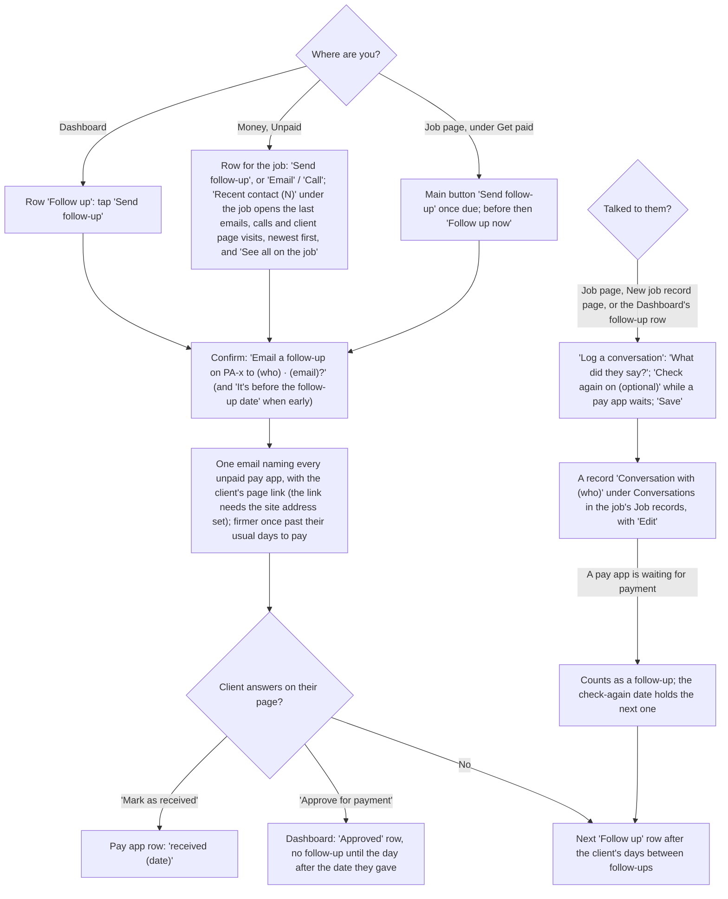
```mermaid
flowchart TD
    A{"Where are you?"} -->|"Dashboard"| B["Row 'Follow up': tap 'Send follow-up'"]
    A -->|"Money, Unpaid"| C["Row for the job: 'Send follow-up', or 'Email' / 'Call'; 'Recent contact (N)' under the job opens the last emails, calls and client page visits, newest first, and 'See all on the job'"]
    A -->|"Job page, under Get paid"| D["Main button 'Send follow-up' once due; before then 'Follow up now'"]
    B --> E["Confirm: 'Email a follow-up on PA-x to (who) · (email)?' (and 'It's before the follow-up date' when early)"]
    C --> E
    D --> E
    E --> G["One email naming every unpaid pay app, with the client's page link (the link needs the site address set); firmer once past their usual days to pay"]
    G --> H{"Client answers on their page?"}
    H -->|"'Mark as received'"| I["Pay app row: 'received (date)'"]
    H -->|"'Approve for payment'"| I2["Dashboard: 'Approved' row, no follow-up until the day after the date they gave"]
    H -->|"No"| J["Next 'Follow up' row after the client's days between follow-ups"]
    TK{"Talked to them?"} -->|"Job page, New job record page, or the Dashboard's follow-up row"| K["'Log a conversation': 'What did they say?'; 'Check again on (optional)' while a pay app waits; 'Save'"]
    K --> K1["A record 'Conversation with (who)' under Conversations in the job's Job records, with 'Edit'"]
    K1 -->|"A pay app is waiting for payment"| K2["Counts as a follow-up; the check-again date holds the next one"]
    K2 --> J
```

Code: Dashboard row kind `follow_up` in `domain.today_rows`, domain/__init__.py:2443 (with **Log a conversation**, `rowButtons` static/js/today.js:58); Unpaid `views.collections`, static/js/views/collections.js:25 (**Recent contact (N)** `recentContactHtml` static/js/views/collections.js:14, from `contact_log`, domain/contact.py:45); job page **Send follow-up** / **Follow up now** static/js/jobs.js:491; the confirm `follow-up` static/js/views/collections.js:71; server `record_follow_up`, domain/__init__.py:1188 (from the third follow-up it also emails the client's **Also email from the third follow-up** address); the client's page `payer_page.render`, payer_page.py:152 (**Mark as received** `mark_received` payer_page.py:211, **Approve for payment** `approve` payer_page.py:226).

Conversations: **Log a conversation** is a job action on any open job (`jobActions`, group Get paid), on the New job record page and on the follow-up row, `log-conversation` static/js/views/job.js:460; form `conversationFormHtml` static/js/views/job.js:72, server `note_contact`, domain/__init__.py:1279, which adds a record of kind `conversation`. `_log_conversation`, domain/__init__.py:1260, makes it count while a pay app waits. **Edit** on the record, `recordRow` static/js/views/job-record.js:21, changes what it is, its kind and **What they said**, server `edit_record`; a record changed to the kind Conversation does what Log a conversation does. Older notes labelled "Spoke to Sam" read and file as "Conversation with Sam", `recordFace` static/js/jobs.js:711; what is stored stays until someone edits it.

**Taps from start to done:** 2 (Send follow-up, then the confirm); 3 for a conversation (Log a conversation, type, Save).

**Where it could still be simpler:**
- The confirm says who it goes to but not what the email says; the Outbox shows the text once it has gone.

---

## 10. Record a payment

**Goal:** record a check or transfer against the right pay app so the waiver step opens.

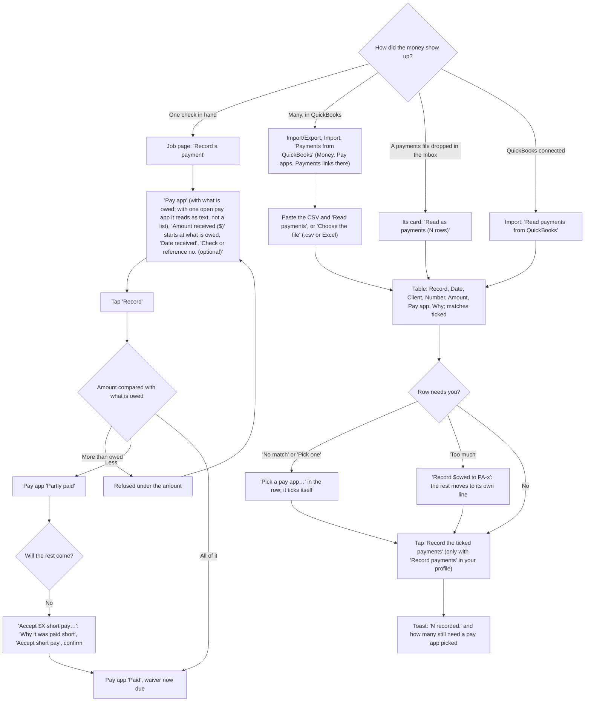
```mermaid
flowchart TD
    A{"How did the money show up?"} -->|"One check in hand"| B["Job page: 'Record a payment'"]
    B --> C["'Pay app' (with what is owed; with one open pay app it reads as text, not a list), 'Amount received ($)' starts at what is owed, 'Date received', 'Check or reference no. (optional)'"]
    C --> D["Tap 'Record'"]
    D --> E{"Amount compared with what is owed"}
    E -->|"More than owed"| F["Refused under the amount"]
    F --> C
    E -->|"Less"| G["Pay app 'Partly paid'"]
    G --> G2{"Will the rest come?"}
    G2 -->|"No"| G3["'Accept $X short pay…': 'Why it was paid short', 'Accept short pay', confirm"]
    G3 --> H
    E -->|"All of it"| H["Pay app 'Paid', waiver now due"]
    A -->|"Many, in QuickBooks"| I["Import/Export, Import: 'Payments from QuickBooks' (Money, Pay apps, Payments links there)"]
    I --> J["Paste the CSV and 'Read payments', or 'Choose the file' (.csv or Excel)"]
    A -->|"A payments file dropped in the Inbox"| J2["Its card: 'Read as payments (N rows)'"]
    J2 --> K
    J --> K["Table: Record, Date, Client, Number, Amount, Pay app, Why; matches ticked"]
    K --> L{"Row needs you?"}
    L -->|"'No match' or 'Pick one'"| L1["'Pick a pay app…' in the row; it ticks itself"]
    L -->|"'Too much'"| L2["'Record $owed to PA-x': the rest moves to its own line"]
    L1 --> M
    L2 --> M
    L -->|"No"| M["Tap 'Record the ticked payments' (only with 'Record payments' in your profile)"]
    M --> N["Toast: 'N recorded.' and how many still need a pay app picked"]
    A -->|"QuickBooks connected"| O["Import: 'Read payments from QuickBooks'"]
    O --> K
```

Code: **Record a payment** card in `views.job` (`match` static/js/views/job.js:514, prefill `prefillPaymentAmount` static/js/views/job.js:254; one open pay app shows as text, the `oneAsText` field option, static/js/forms.js:32), server `match_payment`, domain/__init__.py:1304 (takes `received_on`); short pay `shortPayCardHtml` static/js/views/job.js:52, `accept-short-pay` static/js/views/payapps.js:341, server `settle_short_pay`, domain/__init__.py:1409; the import card `paymentsImportHtml`, static/js/views/payments.js:95-111, on Import (`views.import` static/js/views/data.js:9); Money, Pay apps' **Payments** filter (once its own tab, Round 1 item 19; `/money/payments` opens it) `paymentsListHtml` static/js/views/payments.js:127-149 lists what was recorded, or "No payments yet" with the button that comes next, and links to Import (**Read payments** `qbo-read` static/js/views/payments.js:156, **Choose the file** `qbo-choose-file` static/js/views/payments.js:189, **Record the ticked payments** `qbo-apply` static/js/views/payments.js:164, shown only with `can("record_payments")` (static/js/views/payments.js:9; the route has perm="record_payments", server.py:3152, `_m_payments_apply` server.py:1910), the split `qbo-split` static/js/views/payments.js:176); row cells `qboTick` / `qboPayAppCell` static/js/views/payments.js:62-74 with static/js/payimport.js (`pickPayApp`, `splitTooMuch`, `afterRecord`); server `qbo_csv.parse` qbo_csv.py:330 and `propose` :476; Inbox **Read as payments** `inbox-read-payments` static/js/views/payments.js:182 (opens Import); QuickBooks card `qboCardHtml` static/js/views/payments.js:79 (**Connect QuickBooks**, **Read payments from QuickBooks**, **Check against QuickBooks**, **Disconnect**). The wireframe is `PaymentsImport`.

Refunds: **Received** is payments less money refunded (`collected_cents`, `job_money`, domain/__init__.py:145), on the job card, the CSVs (exports.py), the job file, the monthly summary and the prior payments on the pay app page and the client's page. Payment records stay as they were. The Money card shows **Refunded or credited (taken off Received)** (static/js/views/job-money.js:20) when there is any. A refund is money returned whatever the contract does next: when a later change order raises the contract, what it leaves short shows as owed (`refund_owed_cents`, `_owed_text` domain/__init__.py:222), the **Owed back** row on the Dashboard, and it stops Finish job. It can be recorded with **Record a payment** on the last pay app sent, or cleared with a signed credit; what comes back takes that much off what is owed, and no more is taken once it is back. A credit against a short pay moved no money, so it doesn't come off Received, and it stands only as long as the short pay does: if the client later pays that short pay after all, the job reads overbilled again. **Record refund or credit** is section 13.

**Taps from start to done:** 2 by hand (Record a payment, Record); 3 for a CSV (Read payments, a pick if needed, Record the ticked payments).

**Where it could still be simpler:**
- QuickBooks is read on request, not every day (deferred until a live Intuit connection is tested, improvement plan section 5).

---

## 11. Lien waiver

**Goal:** a conditional waiver goes with each pay app; once it is paid, send the signed unconditional one. Each retainage release owes its own.

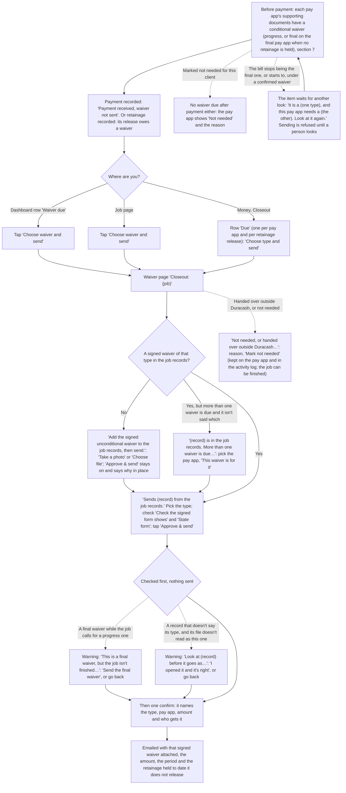
```mermaid
flowchart TD
    A0["Before payment: each pay app's supporting documents have a conditional waiver (progress, or final on the final pay app when no retainage is held), section 7"] --> A
    A0 -.->|"Marked not needed for this client"| AN["No waiver due after payment either: the pay app shows 'Not needed' and the reason"]
    A0 -.->|"The bill stops being the final one, or starts to, under a confirmed waiver"| FL["The item waits for another look: 'It is a (one type), and this pay app needs a (the other). Look at it again.' Sending is refused until a person looks"]
    FL --> A0
    A["Payment recorded: 'Payment received, waiver not sent'. Or retainage recorded: its release owes a waiver"] --> B{"Where are you?"}
    B -->|"Dashboard row 'Waiver due'"| C["Tap 'Choose waiver and send'"]
    B -->|"Job page"| C2["Tap 'Choose waiver and send'"]
    B -->|"Money, Closeout"| C3["Row 'Due' (one per pay app and per retainage release): 'Choose type and send'"]
    C --> D["Waiver page 'Closeout: (job)'"]
    C2 --> D
    C3 --> D
    D --> E{"A signed waiver of that type in the job records?"}
    E -->|"No"| E1["'Add the signed unconditional waiver to the job records, then send.': 'Take a photo' or 'Choose file'; 'Approve & send' stays on and says why in place"]
    E1 --> F
    E -->|"Yes, but more than one waiver is due and it isn't said which"| EW["'(record) is in the job records. More than one waiver is due…': pick the pay app, 'This waiver is for it'"]
    EW --> F
    E -->|"Yes"| F["'Sends (record) from the job records.' Pick the type; check 'Check the signed form shows' and 'State form'; tap 'Approve & send'"]
    D -.->|"Handed over outside Duracash, or not needed"| NN["'Not needed, or handed over outside Duracash…': reason, 'Mark not needed' (kept on the pay app and in the activity log; the job can be finished)"]
    F --> GC{"Checked first, nothing sent"}
    GC -.->|"A final waiver while the job calls for a progress one"| GF["Warning: 'This is a final waiver, but the job isn't finished…': 'Send the final waiver', or go back"]
    GC -.->|"A record that doesn't say its type, and its file doesn't read as this one"| GL["Warning: 'Look at (record) before it goes as…': 'I opened it and it's right', or go back"]
    GF --> G
    GL --> G
    GC --> G["Then one confirm: it names the type, pay app, amount and who gets it"]
    G --> I["Emailed with that signed waiver attached, the amount, the period and the retainage held to date it does not release"]
```

Code: Dashboard row kind `waiver` (**Choose waiver and send**, `open-waiver`); job page **Choose waiver and send** static/js/jobs.js:489; Closeout `views.waivers`, static/js/views/closeout.js:145 (one row per pay app, per retainage release and, while it is still owed, the older job-level **Earlier payment**, `waiverRows` static/js/views/closeout.js:33, with Not needed rows and their reason (their Type is —); **Which type?**, **Not chosen yet**, **Choose type and send**); waiver page `views.waiverDetail`, static/js/views/closeout.js:101, headed **Closeout: (job)** like its tab (**Waivers due**, **Check the signed form shows** `waiverChecklistHtml` static/js/views/paperwork.js:105, whose **Add your legal name** opens Settings, Company at the legal-name box (D2), **State form**, **By pay app** with **Before payment** and **After payment**); **This waiver is for it** `waiver-for` static/js/views/closeout.js:244 when a signed waiver isn't tied to a pay app and more than one is due (`waiverForHtml` static/js/views/closeout.js:78, offering each paid pay app, release and **Earlier payment**, `EARLIER_PAYMENT` domain/__init__.py:1562; server `set_waiver_type` domain/__init__.py:1521 with `for_id`, the choices `_waiver_owed` domain/__init__.py:1565); **Not needed, or handed over outside Duracash…** with **Mark not needed** (`waiverNotNeededHtml` static/js/views/closeout.js:90, server `waiver_not_needed` domain/__init__.py:1812, needs a reason; a client marked not needed owes none after payment, `_waiver_comes_due` domain/__init__.py:1640); type picker and hint `waiverSendForm` static/js/jobs.js:207; server `send_waiver`, domain/__init__.py:1664 (refused until a signed waiver of the type is in the job records, `waiver_on_file` domain/__init__.py:1600, never one that already went out in any email, nor one taken for another pay app or release; one taken for none is refused while more than one waiver is due, `_hold_unclear_waivers` domain/__init__.py:1589), both stages `waiver_stages` domain/__init__.py:1880, the type it suggests `suggested_waiver_kind` domain/__init__.py:1461 (conditional before payment, unconditional after, never final while retainage is held); state forms `helper/waiver_forms.json` (Georgia so far), `/api/waiver-forms` server.py:3052.

Retainage releases: `record_retainage_payment`, domain/__init__.py:1980, adds one waiver per release, unconditional, on final payment only when the job is finished by it; releasing all the retainage on a job half done is a progress waiver, since it gives up no rights to the work still to bill. A release marked final that the job isn't finished for (recorded earlier, or reopened since) is sent as progress unless a person says otherwise. Sending a final waiver when a progress one is due warns and takes a confirm before any email (`confirm_final`, never a hard block).

Type flips: `_name_conditional_waiver`, domain/__init__.py:4416, names the waiver item by whether the pay app is the final one with no retainage held or open. When that changes (a change order written since, say), a waiver confirmed as one type isn't confirmed as the other: `_ask_for_a_look` domain/__init__.py:4973 puts it back to wait with a warning, and `approve_and_send` refuses. A signed waiver filling an item must fit its type (`_fits_waiver_item` domain/__init__.py:4837); an unconditional waiver never fills a conditional item.

The look warning: **Approve & send** reads each file on the waiver's record, whatever its label or type, before any email (`send_waiver`, domain/__init__.py:1664, `look_warning`). When something doesn't match, it says **Look at (record) before it goes as the (type)** with what didn't match, and sends only once a person answers **I opened it and it's right**, for that record (`looked_at`, the `waiver` action static/js/views/closeout.js:204). The activity log keeps it (`waiver_looked_at`). It is a warning, never a hard block (Decision 6). The page asks for those looks first, from a check that sends nothing (`check_only`), and then one confirm sends it (Round 1 acceptance, item 17). **Approve & send** stays on when the signed waiver isn't on the job records yet; the server says why, in place, as on the pay app page (item 18). **State form** starts at the job's state, read from its address boxes or its one-line address (`job_state` domain/__init__.py:2194).

A final waiver that goes out fills the closeout's **Final lien waivers** when it is still missing, whichever type that item names (`_final_waiver_fills_closeout`, domain/__init__.py:1800), so nobody files it twice.

**Taps from start to done:** 2 (Choose waiver and send, Approve & send) and the confirm, plus the type if it isn't the one picked for you.

**Where it could still be simpler:**
- Duracash does not write the waiver: sign the form your state or the client requires and add it to the job records. Only Georgia's forms are listed so far.

---

## 12. Retainage release

**Goal:** get the money held back on the job paid at the end. How much is held is set per job, Retainage % on New job and Edit job, starting at what the client usually holds (section 3).

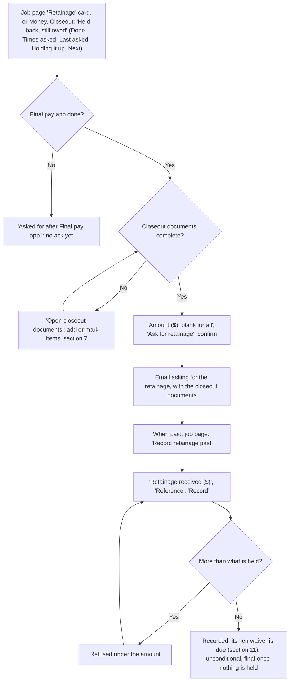
```mermaid
flowchart TD
    A["Job page 'Retainage' card, or Money, Closeout: 'Held back, still owed' (Done, Times asked, Last asked, Holding it up, Next)"] --> B{"Final pay app done?"}
    B -->|"No"| C["'Asked for after Final pay app.': no ask yet"]
    B -->|"Yes"| D{"Closeout documents complete?"}
    D -->|"No"| E["'Open closeout documents': add or mark items, section 7"]
    E --> D
    D -->|"Yes"| F["'Amount ($), blank for all', 'Ask for retainage', confirm"]
    F --> G["Email asking for the retainage, with the closeout documents"]
    G --> J["When paid, job page: 'Record retainage paid'"]
    J --> K["'Retainage received ($)', 'Reference', 'Record'"]
    K --> L{"More than what is held?"}
    L -->|"Yes"| M["Refused under the amount"]
    M --> K
    L -->|"No"| N["Recorded; its lien waiver is due (section 11): unconditional, final once nothing is held"]
```

Code: the job page's **Retainage** card `retainageCardHtml`, static/js/views/job-money.js:42 (rate, held, released, still held, **Job done**, **Times asked**, **Last asked**, **Next ask allowed**, **Pay apps holding it**, **Releases** with each one's waiver, **Closeout documents** with its files, shown, like the job page's line under Pay apps, once the work is done or one of them is filed, not from the first progress draft (`closeoutShown` static/js/jobs.js:312, Round 1 acceptance item 25); figures `retainageFacts` static/js/jobs.js:244); Closeout's held-back table in `views.waivers`, static/js/views/closeout.js:144-194, `retainageAskHtml` :17; job page **Ask for retainage** only once the work is done and the closeout documents is in (static/js/jobs.js:504; the card says why otherwise, `retainageNote` static/js/jobs.js:412); after a request, whole or part, the next waits the client's **Days between follow-ups** (`retainageAskWaits` static/js/jobs.js:406, the server's wait in `chase_retainage`); the confirm static/js/views/closeout.js:21; server `chase_retainage`, domain/__init__.py:1918 (refused before the job is marked done); **Record retainage paid** card in `views.job`, `retainage-paid` static/js/views/job.js:466, its amount filled in with the retainage still held, offered once retainage can be released: the work is done, or it was asked for, or some of it already came in, not from the first pay app on (`retainageReleasable` static/js/jobs.js:319, Round 1 acceptance item 16); server `record_retainage_payment`, domain/__init__.py:1980 (each release owes a lien waiver, `retainage_waivers`).

**Take credit off retainage**: a signed credit that leaves the job overbilled can come out of the retainage held, so the client doesn't pay that part of it and nothing was overpaid to refund. It needs the Record payments permission and a reason (**What was agreed**), and is in the activity log (`apply_credit_to_retainage`, domain/__init__.py:6043). It lowers the open retainage with no money received, up to what is overbilled, held and signed (`retainage_credit_room`, domain/__init__.py:233), and shows as **Signed credit taken off retainage** on the Money card. When it takes the last of what was held with nothing else open, the job is finished by it, so the final lien waiver comes due, as a release row headed **Signed credit**, unless a final waiver already went out or the client doesn't take them. The button is on the **Before you can finish this job** list (`closeBlockerActions`, static/js/jobs.js:546).

**Taps from start to done:** 4 (Ask for retainage and the confirm, then later Record retainage paid, Record), then the release's waiver (section 11).

**Where it could still be simpler:**
- The closeout documents hold back the ask for the money, not the Finish job warning: section 13.

---

## 13. Finish the job

**Goal:** file a fully settled job away in Job history, with its job file.

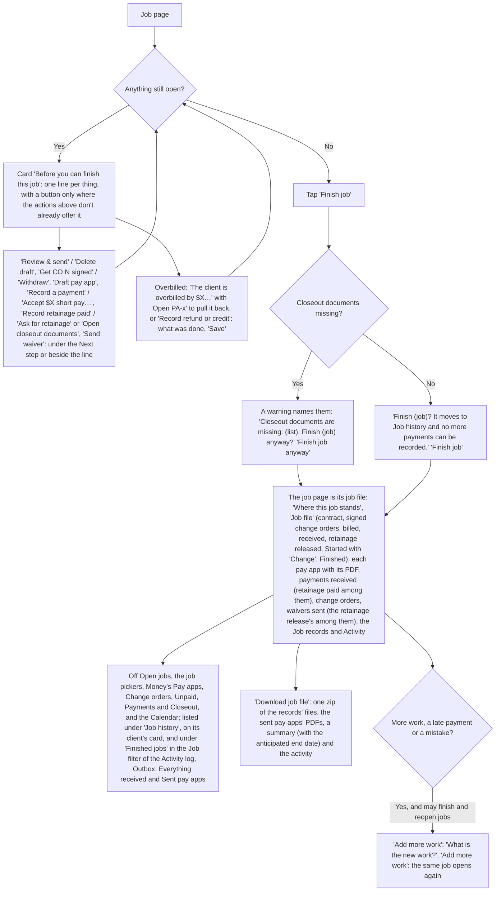
```mermaid
flowchart TD
    A["Job page"] --> B{"Anything still open?"}
    B -->|"Yes"| C["Card 'Before you can finish this job': one line per thing, with a button only where the actions above don't already offer it"]
    C --> D["'Review & send' / 'Delete draft', 'Get CO N signed' / 'Withdraw', 'Draft pay app', 'Record a payment' / 'Accept $X short pay…', 'Record retainage paid' / 'Ask for retainage' or 'Open closeout documents', 'Send waiver': under the Next step or beside the line"]
    C --> OB["Overbilled: 'The client is overbilled by $X…' with 'Open PA-x' to pull it back, or 'Record refund or credit': what was done, 'Save'"]
    OB --> B
    D --> B
    B -->|"No"| E["Tap 'Finish job'"]
    E --> E1{"Closeout documents missing?"}
    E1 -->|"Yes"| E2["A warning names them: 'Closeout documents are missing: (list). Finish (job) anyway?' 'Finish job anyway'"]
    E1 -->|"No"| E3["'Finish (job)? It moves to Job history and no more payments can be recorded.' 'Finish job'"]
    E2 --> F
    E3 --> F["The job page is its job file: 'Where this job stands', 'Job file' (contract, signed change orders, billed, received, retainage released, Started with 'Change', Finished), each pay app with its PDF, payments received (retainage paid among them), change orders, waivers sent (the retainage release's among them), the Job records and Activity"]
    F --> G["Off Open jobs, the job pickers, Money's Pay apps, Change orders, Unpaid, Payments and Closeout, and the Calendar; listed under 'Job history', on its client's card, and under 'Finished jobs' in the Job filter of the Activity log, Outbox, Everything received and Sent pay apps"]
    F --> DL["'Download job file': one zip of the records' files, the sent pay apps' PDFs, a summary (with the anticipated end date) and the activity"]
    F --> H{"More work, a late payment or a mistake?"}
    H -->|"Yes, and may finish and reopen jobs"| I["'Add more work': 'What is the new work?', 'Add more work': the same job opens again"]
```

Code: the card in `views.job` from `close_blocker_items`, domain/__init__.py:247 ("A lien waiver is still due." until every paid pay app's and every retainage release's waiver is sent), buttons `closeBlockerActions`, static/js/jobs.js:546, less those the Next step and the actions above already show (Round 1, item 6: the list stays, the duplicate buttons go); **Finish job** static/js/jobs.js:131 and its warning and confirm `close` static/js/views/job.js:525 (missing closeout documents warn and ask, they don't stop it; Nov 3 review); server `close_job`, domain/__init__.py:4002. Overbilled comes from `job_money`, domain/__init__.py:145: work billed past the contract and signed change orders (a credit signed after the bill went out, say). **Record refund or credit** is `overbilling-settled` static/js/views/job.js:484, server `settle_overbilling`, domain/__init__.py:6014: what was done is required, kept and in the activity log, and the job can then be finished. The job file `archiveHtml` static/js/views/job.js:183 (J9) with **Change** for the start date (`save-start` static/js/views/job.js:499); **Download job file** GET /api/jobs/<id>/archive/job-file.zip, `job_archive.build` job_archive.py:87 (anyone signed in to the company); **Add more work** in `views.job` (`reopen` static/js/views/job.js:493), server `reopen_job`, domain/__init__.py:4013 (the Finish and reopen jobs permission, `JOB_ACTION_PERMS` domain/profiles.py:54); the open jobs `openJobs` static/js/jobs.js:638, used by Money's lists and `views.calendar`; the job filters on pages of records `jobFilterOptions` static/js/jobs.js:683 (open jobs, then "Finished jobs"); a job with only drafts deleted before they were sent and no payments can be deleted instead (**Delete job** under Edit job, `can_delete_job` domain/__init__.py:5578).

**Taps from start to done:** 2 (Finish job, the confirm).

**Where it could still be simpler:**
- The Job filters on the pages of records offer only jobs finished in the last 90 days; an older job's records are in its job file under Job history.

---

## 14. The Dashboard routine

**Goal:** open one page, see everything waiting, who has it and when it is due, and handle it top to bottom. Each person gets their own rows by email each morning there is something due: an owner gets what is assigned to them and what nobody has; a member gets what is assigned to them.

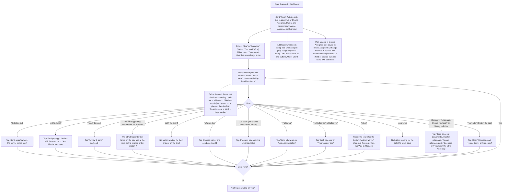
```mermaid
flowchart TD
    A["Open Duracash: Dashboard"] --> T["Card 'To do': Activity, Job, Ball in court (Us or Client), Assignee, Due (a one-person team has no Assignee or Due box)"]
    T --> T1["Filters: 'Mine' or 'Everyone'; 'Today', 'This week' (first), 'This month', 'Date range'. Overdue rows always show"]
    T --> T2["'Add task': what needs doing, Job (with an open job), Assignee (with a team), Due, Ball in court as two buttons, Us or Client"]
    T --> T3["Pick a name in a row's Assignee box: saved at once ('Assigned.'); change the date in its Due box: saved at once ('Due Nov 3, 2026.'), cleared puts the row's own date back"]
    T1 --> C["Rows most urgent first, three at a time ('and N more'); a task added by hand has 'Done'"]
    C -.- B["Below the card: Done, not billed · Outstanding · Held back, still owed · Billed this month (two by two on a phone), then the fold 'Results · sent to paid: N days median'"]
    C --> D{"Row"}
    D -->|"'Didn't go out'"| D1["Tap 'Send again' (where the server sends mail)"]
    D -->|"'Job's done?'"| E["Tap 'Final pay app': the box with the amount, or 'Just file the message'"]
    D -->|"'Needs supporting documents' or 'Blocked'"| G["The job's blocker button: lands on the pay app at the item, or the change order, section 7"]
    D -->|"'Ready to send'"| F["Tap 'Review & send': section 8"]
    D -->|"'With the client'"| F2["No button: waiting for their answer on the draft"]
    D -->|"'Waiver due'"| H["Tap 'Choose waiver and send', section 11"]
    D -->|"'Due soon' (the client's cutoff within 5 days)"| I["Tap 'Progress pay app': the job's Next step"]
    D -->|"'Not billed' or 'Not billed yet'"| K["Tap 'Draft pay app' or 'Progress pay app'"]
    D -->|"'Closeout', 'Retainage', 'Before you finish' or 'Ready to finish'"| RF["Tap 'Open closeout documents', 'Ask for retainage', 'Record retainage paid', 'Open job' or 'Finish job': the job's Next step"]
    D -->|"'Follow up'"| J["Tap 'Send follow-up', or 'Log a conversation'"]
    D -->|"'Approved'"| J2["No button: waiting for the date the client gave"]
    D -->|"'Inbox'"| L["Check the kind after the button ('as Lien waiver'; change it if wrong), then tap 'Add to This Job'"]
    D -->|"'Reminder' (fired in the app)"| RM["Tap 'Open' (it is read, and you go there) or 'Mark read'"]
    D1 --> M{"More rows?"}
    E --> M
    F --> M
    G --> M
    H --> M
    I --> M
    J --> M
    K --> M
    L --> M
    RF --> M
    RM --> M
    M -->|"Yes"| C
    M -->|"No"| N["'Nothing is waiting on you.'"]
```

The rows and the job page agree: `domain.today_rows` gives one next step per job, in the order of the job page's `jobActions`, in its words, with its button's label. A row that needs more than a tap opens the job at its **Next step** card (`OPENS_JOB`, `ACTIONS` static/js/today.js:22; **Before you finish** opens at **Before you can finish this job**). A follow-up is a row of its own beside that job's other row. Rows that wait on the client say so: **With the client**, **Approved**, and a retainage ask already made (ball in court Client, due the day it can be asked again). A reminder fired in the app (Settings, My account, Notifications, section 18) is a **Reminder** row for the person it is for, under Mine too, with **Open** and **Mark read** (`reminderItems` static/js/views/automations.js:40, `rowButtons` static/js/today.js:58); one about dates or a held-up pay app on a job that already has its own row is left off.

On a phone each row is the job's name, the pill, one sentence and one button (the Job column is hidden there, so the name leads the row, Round 1 acceptance item 15); the four money tiles sit two by two, and each job is one line with its name, its pill and what it is owed (Round 1, item 17). Above the card, the setup checklist counts what it numbers and starts with **Create your first job**; its optional steps fold under **Optional steps (N)**, and an unconfirmed email is one plain line under the heading, not a red banner (`onboardingHtml` static/js/views/today.js:191, item 9). **Results**, once a tab, is a fold under the tiles once a pay app has gone out, its line the sent-to-paid median (`resultsHtml` static/js/views/today.js:276, item 19); `/dashboard/results` opens it. With one person on the team the To do card has no Assignee or Due box, and Add task drops Job with no open job and Assignee (the task is still the adder's).

Code: the rows and their order `domain.today_rows`, domain/__init__.py:2443 (one rule set for the Dashboard and the daily email `daily_digest` domain/__init__.py:2622, sent per person by `_digests`, monthly.py:140; finishing rows go in the email once a week, every seventh day from the day the work was marked done, or Mondays for an older job, `WEEKLY_DIGEST_KINDS` and `_digest_week_day` domain/__init__.py:2611, and stay on the Dashboard every day); each row's key, due date, ball in court and assignee `decorate_rows`, domain/tasks.py:50 (assigned with `assign_row` domain/tasks.py:254, tasks added by hand `add_task` domain/tasks.py:178, `edit_task` domain/tasks.py:197; `set_task_done` domain/tasks.py:236; routes `/api/tasks…`, handlers `_task_change` server.py:2013; a team member removed: `reassign_open_tasks` domain/tasks.py:295, which moves their open tasks, their rows and the jobs they were assigned to the owner who removed them, called from `_p_team_remove` server.py:2139); one list and the period filter `todoItems` / `periodRange` / `inPeriod`, static/js/tasks.js:35; drawn by `todoHtml` / `rowButtons` / `assignSelect` / `dueInput`, static/js/today.js:91; the card `todoCardHtml` static/js/views/today.js:78 with **Add task** `taskFormHtml` static/js/views/today.js:62 (an Inbox row's kind select, which starts at the kind the Inbox guessed, `inboxKindSelect` static/js/today.js:50, sent as the row's `item_kind`); Dashboard page `views.dashboard`, static/js/views/today.js:310 (metrics, Results and the jobs table under the card); the "Job's done?" box `inbox-mark-done` static/js/views/inbox.js:520. The daily email is turned off in Settings, Company: **Daily email of what's due**. A row with no date of its own is sent with a blank due date and is due on the person's own today (`todoItems`; the server's day is UTC, already tomorrow on a US evening); the same goes for a new job's start date and a Diary entry's day, which take the date the page sends (`local_today` domain/jobinfo.py:100). A due date set by hand is kept with the row's own date at the time (`row_due`) and stops applying when the row comes back with a new one (`_override_holds` domain/tasks.py:75); `prune_assignments` domain/tasks.py:100 drops those and the assignments of rows that are gone before every save. The daily email lists a "due soon" row as soon as it shows, so the pay app can be got ready before the cutoff; only a row whose date was set by hand waits for that day (`due_now` in `daily_digest`).

**Taps from start to done:** 1 to 2 per row. A typical week with one send, one follow-up and two filings is about 6 taps with the confirms.

**Where it could still be simpler:**
- A pay app ready to send is due on the client's next cutoff, so with a cutoff weeks away it shows under **This month**, not **This week**.

The Calendar starts with **Tasks** (T6): the same items and the calendar's dates in **This week**, **Next week**, **This month** or **Custom**, each opening its day, with **Add task** (`tasksBlockHtml`, static/js/views/today.js:103).

---

## 15. Client playbook

**Goal:** keep each client's rules (who signs off, where pay apps go, follow-up timing, the supporting documents list) right, since they drive every pay app and follow-up. A complete playbook is the client's name and type, who signs off, the billing email and a phone number; the rest has defaults.

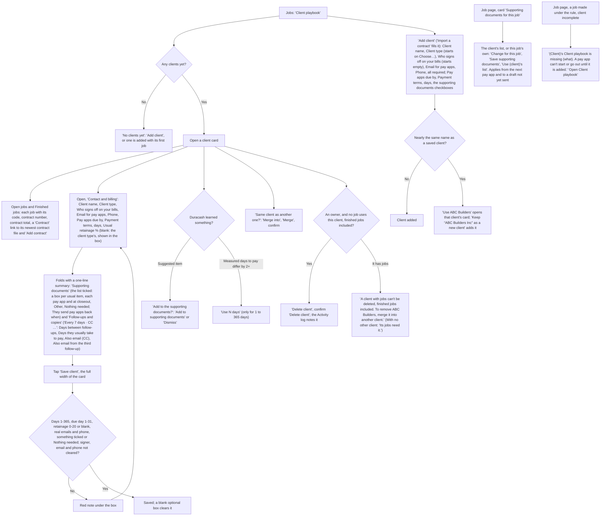
```mermaid
flowchart TD
    A["Jobs: 'Client playbook'"] --> B{"Any clients yet?"}
    B -->|"No"| C["'No clients yet': 'Add client', or one is added with its first job"]
    B -->|"Yes"| D["Open a client card"]
    A --> AC["'Add client' ('Import a contract' fills it): Client name, Client type (starts on Choose…), Who signs off on your bills (starts empty), Email for pay apps, Phone, all required; Pay apps due by, Payment terms, days, the supporting documents checkboxes"]
    AC --> AN{"Nearly the same name as a saved client?"}
    AN -->|"No"| AD["Client added"]
    AN -->|"Yes"| AQ["'Use ABC Builders' opens that client's card; 'Keep “ABC Builders Inc” as a new client' adds it"]
    D --> JB["Open jobs and Finished jobs: each job with its code, contract number, contract total, a 'Contract' link to its newest contract file and 'Add contract'"]
    D --> E["Open, 'Contact and billing': Client name, Client type, Who signs off on your bills, Email for pay apps, Phone, Pay apps due by, Payment terms, days, Usual retainage % (blank: the client type's, shown in the box)"]
    E --> E2["Folds with a one-line summary: 'Supporting documents' (the list ticked: a box per usual item, each pay app and at closeout, Other, Nothing needed; They send pay apps back when) and 'Follow-ups and copies' ('Every 7 days · CC …': Days between follow-ups, Days they usually take to pay, Also email (CC), Also email from the third follow-up)"]
    E2 --> F["Tap 'Save client', the full width of the card"]
    F --> G{"Days 1-365, due day 1-31, retainage 0-20 or blank, real emails and phone, something ticked or Nothing needed; signer, email and phone not cleared?"}
    G -->|"No"| H["Red note under the box"]
    H --> E
    G -->|"Yes"| I["Saved; a blank optional box clears it"]
    D --> J{"Duracash learned something?"}
    J -->|"Suggested item"| K["'Add to the supporting documents?': 'Add to supporting documents' or 'Dismiss'"]
    J -->|"Measured days to pay differ by 2+"| L["'Use N days' (only for 1 to 365 days)"]
    D --> MG["'Same client as another one?': 'Merge into', 'Merge', confirm"]
    D --> DL{"An owner, and no job uses this client, finished jobs included?"}
    DL -->|"Yes"| DY["'Delete client', confirm 'Delete client'; the Activity log notes it"]
    DL -->|"It has jobs"| DN["'A client with jobs can't be deleted, finished jobs included. To remove ABC Builders, merge it into another client.' (With no other client: 'Its jobs need it.')"]
    JP["Job page, card 'Supporting documents for this job'"] --> JP1["The client's list, or this job's own: 'Change for this job', 'Save supporting documents', 'Use (client)'s list'. Applies from the next pay app and to a draft not yet sent"]
    MS["Job page, a job made under the rule, client incomplete"] --> MS1["'(Client)'s Client playbook is missing (what). A pay app can't start or go out until it is added.' 'Open Client playbook'"]
```

Code: page `views.playbook`, static/js/views/clients.js:165 (**Add client** `add-payer` static/js/views/clients.js:313, server `add_payer` domain/__init__.py:3096; **Save client** `save-playbook` static/js/views/clients.js:267, server `update_payer`, domain/__init__.py:2834; the jobs `clientJobsHtml` static/js/views/clients.js:84, asked for when the card opens from GET /api/payers/<id>/jobs, `payer_jobs` domain/jobinfo.py:218, finished jobs included (S10); the boxes `paperworkHtml` static/js/views/clients.js:99, built by `paperworkChoices` static/js/jobs.js:732 from the server's standard catalog `PAPERWORK_ITEMS` domain/__init__.py:4459, saved as the comma list the server reads, `parse_packet_text` domain/__init__.py:4117 (S11); **Import a contract** as on New job (S12); **Merge** `merge-payer` static/js/views/clients.js:358, server `merge_payer`, domain/__init__.py:3150; **Use ABC Builders** / **Keep “ABC Builders Inc” as a new client** `ap-same-use` / `ap-same-keep` static/js/views/clients.js:348; **Delete client** `delete-payer` static/js/views/clients.js:353, shown by `deletePayerHtml` static/js/views/jobs.js:193 to those whose profile may edit client settings when `job_count` is 0, server `delete_payer` domain/__init__.py:3172). Every label has an (i) with the trade term (`FIELD_HELP`, static/js/help.js); the (i) is out of the Tab order and its words describe the box (Round 1, item 11).

The card is in three sections (Round 1, item 18): **Contact and billing** open, with the money in it, then **Supporting documents** and **Follow-ups and copies** as folds, each with a one-line summary and remembered (`playbookSection` static/js/views/clients.js:132), opened by themselves when a box in them is refused, and a full-width **Save client**. **Usual retainage %** (item 1) is the client's own figure, `retainage_pct`, 0 to 20; blank goes by the client type, whose figure shows in the empty box (`usualRetainage` static/js/views/clients.js:19, placeholder `retainage_default`). **Save client** sends it to `/api/payers/<id>/update` with the rest; a figure past 20 is refused under the box, here and by `update_payer`. It is what New job starts at for this client (section 3); jobs already made keep theirs. The read-only card shows it as **Usual retainage %**.

Required playbook: `playbook_missing`, domain/__init__.py:2964; the boxes `PLAYBOOK_FIELDS`, domain/__init__.py:2943. A value saved can be changed, not cleared: `update_payer` refuses a blank signer, email or phone once it has one ("Enter the email pay apps go to, like ap@builder.com."), and Add client and New job refuse a client without them, so a client with no email only exists in data from before the rule. Such a client is asked for what it lacks the next time it is used for a new job, and its existing jobs aren't held up (Nov 3 Decisions 3 and 4). A job made under the rule has `playbook_required`, so `_need_playbook`, domain/__init__.py:3004, stops a pay app starting or going out while the playbook is incomplete, and the job page's card `playbookMissingHtml` static/js/views/job-paperwork.js:14 says what is missing with **Open Client playbook** `open-client-card` static/js/views/clients.js:335. Who signs off that only defaulted to the client's own name (`signer_defaulted`) starts empty on the card (`signerDefaulted` static/js/views/clients.js:16), so a plain save isn't an answer; typing it sends `approver_confirmed`, kept on the client until the signer changes.

Anticipated end date: on New job and Edit job (`anticipated_end_on`, `parse_end_date` domain/jobinfo.py:86: blank until known, never before the start date; a contract's completion date fills it). It shows in **Where this job stands** (`job_key_dates` domain/jobinfo.py:175), on the calendar feed while the job is open (`events` calendar_feed.py:43), in the Jobs CSV (`jobs_rows` exports.py:55), in the job file's summary (job_archive.py:47) and in Important dates reminders.

Per job: the card **Supporting documents for this job**, `jobPaperworkHtml` static/js/views/job-paperwork.js:26, server `set_job_paperwork`, domain/__init__.py:4254, keeps the job's own list (`paperwork_labels`), audited; **Use (client)'s list** goes back. A job on the older job-level list can't have its own. Public jobs: **Certified payroll** and **Notarized pay application** are items of the catalog, each with a record kind of its own, so a time sheet or the app's backup doesn't fill them (`PAPERWORK_ITEMS`). Tick them on the client, or for one job on this card.

Who can change a client: the Team page's **Edit company details, client settings and connections** (`company`). The server checks it on `/api/payers/<id>/update`, `/merge`, `/delete`, `/waiver-needed` and `/suggestion/<id>/add` or `dismiss` (`ROUTES`, server.py:3028). Without it the card reads only (`clientReadOnlyHtml`, static/js/views/clients.js:23): its settings as rows, a suggestion to read with no buttons, and no **Save client**, **Use N days**, **Needed after all** or **Merge**. Three things stay open to everyone on the team. **Add client** and New job make a new client, which changes no saved one. New job fills in what a saved client is missing, and so do **Save email** on Review & send and the boxes under **Still missing** on the read-only card, which is where **Open Client playbook** lands: `/api/payers/<id>/missing`, `fill_missing_client_details`, domain/__init__.py:2971, takes only the blank who signs off, email, phone or client type, refuses one already saved, and ignores every other setting. And **Client sent pay app back** adds its reason to **They send pay apps back when** and suggests a document (`learn_rejection`, domain/__init__.py:3991); the suggestion waits for someone with the permission.

**Taps from start to done:** 2 (open the card, Save client), plus 1 per suggestion.

---

## 16. Team, permissions and signing in

**Goal:** bring people in with the right permissions, keep the company's deletion with one person, and sign in safely. The screens are the wireframes `Settings` and `TwoStep`.

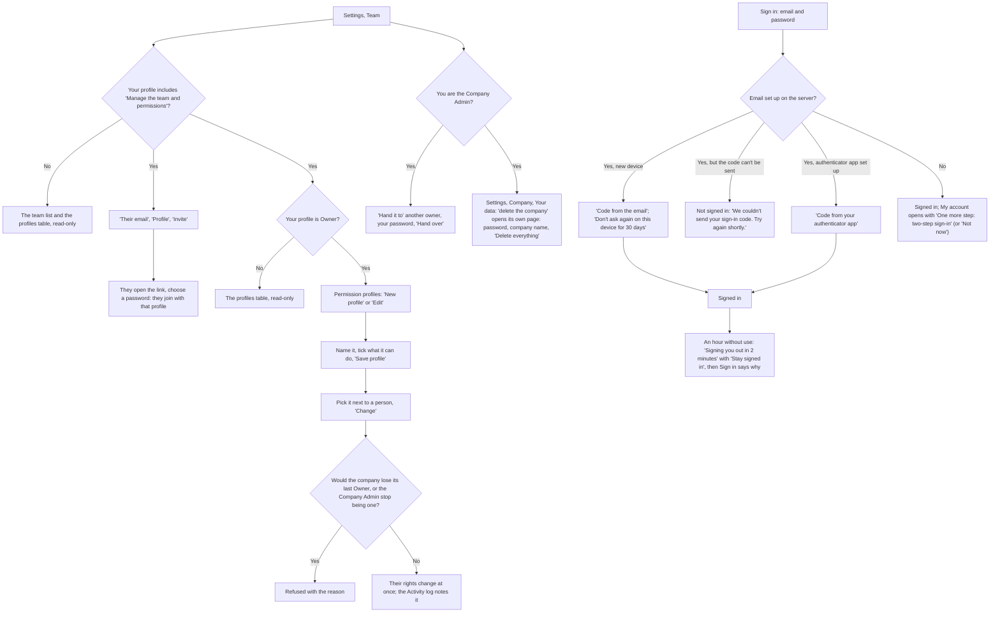
```mermaid
flowchart TD
    A["Settings, Team"] --> B{"Your profile includes 'Manage the team and permissions'?"}
    B -->|"No"| B1["The team list and the profiles table, read-only"]
    B -->|"Yes"| C["'Their email', 'Profile', 'Invite'"]
    C --> D["They open the link, choose a password: they join with that profile"]
    B -->|"Yes"| E0{"Your profile is Owner?"}
    E0 -->|"No"| E1["The profiles table, read-only"]
    E0 -->|"Yes"| E["Permission profiles: 'New profile' or 'Edit'"]
    E --> F["Name it, tick what it can do, 'Save profile'"]
    F --> G["Pick it next to a person, 'Change'"]
    G --> H{"Would the company lose its last Owner, or the Company Admin stop being one?"}
    H -->|"Yes"| H1["Refused with the reason"]
    H -->|"No"| H2["Their rights change at once; the Activity log notes it"]
    A --> K{"You are the Company Admin?"}
    K -->|"Yes"| K1["'Hand it to' another owner, your password, 'Hand over'"]
    K -->|"Yes"| K2["Settings, Company, Your data: 'delete the company' opens its own page: password, company name, 'Delete everything'"]
    S["Sign in: email and password"] --> T{"Email set up on the server?"}
    T -->|"Yes, new device"| T1["'Code from the email'; 'Don't ask again on this device for 30 days'"]
    T -->|"Yes, but the code can't be sent"| T4["Not signed in: 'We couldn't send your sign-in code. Try again shortly.'"]
    T -->|"Yes, authenticator app set up"| T2["'Code from your authenticator app'"]
    T -->|"No"| T3["Signed in; My account opens with 'One more step: two-step sign-in' (or 'Not now')"]
    T1 --> U["Signed in"]
    T2 --> U
    U --> V["An hour without use: 'Signing you out in 2 minutes' with 'Stay signed in', then Sign in says why"]
```

Code: Team page `teamView`, static/js/views/settings.js:252, with `teamCardHtml` static/js/views/settings.js:83 (**Change** `team-profile` static/js/views/settings.js:662), `profilesCardHtml` static/js/views/settings.js:121 and `profileFormHtml` static/js/views/settings.js:136 (**New profile**, **Edit**, **Save profile** `profile-save` static/js/views/settings.js:674, **Delete** `profile-delete` static/js/views/settings.js:685; shown to owners only, `ownerMe()`), `adminCardHtml` static/js/views/settings.js:151 (**Hand over** `admin-hand-over` static/js/views/settings.js:689). The permissions and the job action each needs are `PERMISSIONS` and `JOB_ACTION_PERMS`, domain/profiles.py:25 and domain/profiles.py:54. Round 1 (item 2) added **Change a job's contract, change orders and mark work done** (`manage_jobs`): Edit job, Final pay app and Undo done, signing a change order on paper, withdrawing one and billing one before it is signed (Bill now) take it, and a schedule of values saved as the new contract amount does too (`_may_change_contract`, server.py:3275; setting up a brand-new job's schedule and contract at New job doesn't, section 3). Owner holds it; Member doesn't, and keeps records, conversations, drafts, progress and documents. A profile of your own made before it existed gets it when it held **Delete drafts, pull back sent pay apps and accept short pays** or **Finish and reopen jobs** (`grant_manage_jobs` domain/profiles.py:231, the migration step `_round1_manage_jobs` migrations.py:271, schema 13 to 14, safe to run again). Every way to them is gated, not only the job page's buttons (Round 1 hunt, `tests/test_hunt_r1.py` reads server.py for each call): the Inbox's mark-done on a message that says the job is done (`_m_inbox`, server.py:1986; the Inbox and the Dashboard's **Job's done?** row show the button only to those who may, and anyone can still file the message), and a signed change order uploaded with the file (`_import_file`, server.py:2338): without `manage_jobs` the copy is filed to the change order as its backup with who signed it and when, the change order stays pending, and the answer and the change order say "Someone who can approve change orders has to mark it signed." (`file_signed_co_copy` domain/__init__.py:3693, history "Signed copy filed"). The page hides those buttons for anyone without it, as for the other gated actions; the server checks `has_perm` on every route flagged perm= (`_run`, server.py:977, the check at server.py:1005; owner=True routes at server.py:1002, refused with "Only an owner can add, change or delete permission profiles.", `OWNER_ONLY`) and `may_take` on every job action (`_m_job_action`, server.py:2854), and the page hides the same through `mayTake` and `ACTION_PERM`, static/js/jobs.js:439-453, and `can`, static/js/app-core.js:481. Profiles are saved by `_p_profile_save`, server.py:2166 (`save_profile`, domain/profiles.py:160), on owner=True routes, server.py:3061-3063, so only the Owner profile adds, changes or deletes them (A4); a person's profile by `set_role`, auth.py:1078; the Company Admin is `_admin`, auth.py:935, handed on by `hand_over_admin`, auth.py:1150, and the only one `_p_account_delete` lets through, server.py:2156; the delete page is `deleteCompanyView`, static/js/views/settings.js:263. Signing in: `_p_login`, server.py:1541, asks for an emailed code when `_email_code_due`, server.py:1598 (`login_code_check` and `remember_device`, auth.py:1299-1318); a code that can't be sent (`_send_login_code`, server.py:1609, off the shared hourly limit) gives no session; five wrong codes drop the live ones (`_wrong_code`, auth.py:715), and the count of wrong tries clears only once every step has passed (`login_succeeded`, auth.py:543); a password reset (`reset_password`, auth.py:782) forgets remembered devices; the code step on the landing card, static/js/views/auth.js:79-88; with no mail on the server the setup card comes first (`twoStepCardHtml`, static/js/views/settings.js:342, **Not now** `2fa-later` static/js/views/settings.js:729). **Change password** opens `passwordView`, static/js/views/settings.js:376 (**Email me a code** `pw-code`, server `_p_password_code`, server.py:1828). Appearance is `appearanceCardHtml`, static/js/views/settings.js:327, saved with My account's one **Save** (`save-account`, static/js/views/settings.js:744) through `_p_appearance`, server.py:2204, and applied by `applyAppearance`, static/js/theme.js:24, to the dark palette and accents in static/styles.css:816. The idle sign-out is `session_check`, auth.py:600, and static/js/idle.js.

**Taps from start to done:** a new profile and a person on it: 4 (New profile, Save profile after ticking, pick it, Change). Sign in from a new device with email codes: 2 (Sign in, then Sign in with the code).

---

## 17. New job record

**Goal:** one form for what happened on site and the day's documents: delivery tickets, progress photos, time sheets, invoices, inspections. It replaces the daily record and the old "add a note to the record".

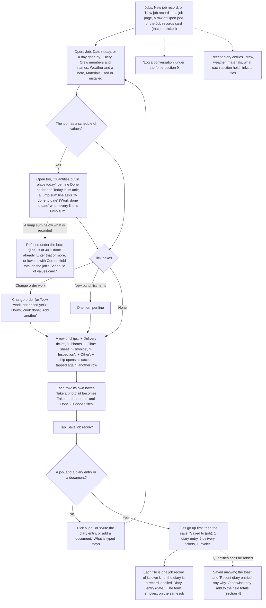
```mermaid
flowchart TD
    A["Jobs, New job record; or 'New job record' on a job page, a row of Open jobs or the Job records card (that job picked)"] --> B["Open: Job, Date (today, or a day gone by), Diary, Crew members and names, Weather and a note, Materials used or installed"]
    B --> Q0{"The job has a schedule of values?"}
    Q0 -->|"Yes"| C1["Open too, 'Quantities put in place today': per line Done so far and Today in its unit; a lump-sum line asks '% done to date' ('Work done to date' when every line is lump sum)"]
    C1 -.->|"A lump sum below what is recorded"| C1R["Refused under the box: '(line) is at 40% done already. Enter that or more, or lower it with Correct field total on the job's Schedule of values card.'"]
    Q0 --> C{"Tick boxes"}
    C1 --> C
    C -->|"Change order work"| C2["Change order (or 'New work, not priced yet'), Hours, Work done; 'Add another'"]
    C -->|"New punchlist items"| C3["One item per line"]
    C2 --> D
    C3 --> D
    C -->|"None"| D["A row of chips: '+ Delivery ticket', '+ Photos', '+ Time sheet', '+ Invoice', '+ Inspection', '+ Other'. A chip opens its section; tapped again, another row"]
    D --> D1["Each row: its own boxes, 'Take a photo' (it becomes 'Take another photo' until 'Done'), 'Choose files'"]
    D1 --> E["Tap 'Save job record'"]
    E --> F{"A job, and a diary entry or a document?"}
    F -->|"No"| G["'Pick a job.' or 'Write the diary entry, or add a document.' What is typed stays"]
    G --> B
    F -->|"Yes"| H["Files go up first, then the save. 'Saved to (job): 1 diary entry, 2 delivery tickets, 1 invoice.'"]
    H --> I["Each file is one job record of its own kind; the diary is a record labelled 'Diary entry (date)'. The form empties, on the same job"]
    H -.->|"Quantities can't be added"| QX["Saved anyway; the toast and 'Recent diary entries' say why. Otherwise they add to the field totals (section 4)"]
    A -.-> CV["'Log a conversation' under the form, section 9"]
    A -.-> RC["'Recent diary entries': crew, weather, materials, what each section held, links to files"]
```

Code: the form `views.daily`, static/js/views/daily.js:62 (Round 1, item 15: the Diary, crew, weather and quantities open; the tick boxes `SECTIONS` static/js/views/daily.js:31 for change order work and punchlist items, `sectionHtml` static/js/views/daily.js:138; the document sections `RECORD_SECTIONS` static/js/views/daily.js:39, opened from the chips `recordChipsHtml` static/js/views/daily.js:125 and shown whenever something is in them, `sectionOpen` static/js/views/daily.js:116, `recordSectionHtml` static/js/views/daily.js:103; **Take a photo** takes several, `multiple` with `capture`, then **Done** shows "N photos" with **Add more**, `filePickers` static/js/views/daily.js:90); **Save job record** `daily-save`, `saveRecord` static/js/views/daily.js:380; files go up one at a time `uploadDailyFiles` static/js/views/daily.js:310 with `for_job_record=1`, so a second Save doesn't upload them again and only the person's own waiting files can be filed (`hold_for_job_record` domain/daily.py:340, `_may_file` domain/daily.py:350); what a Save made `savedWords` static/js/views/daily.js:291. Server `add_daily_record` domain/daily.py:291 (every field checked by `clean_daily_details` domain/daily.py:109; the record's label `Diary entry <date>`, with any quantities; the note read out by `daily_record_note` domain/daily.py:255). Delivery tickets and time sheets share the kind `ticket` with a `ticket_type`, domain/daily.py:46, so they group apart on the job (section 5) and still fill the **Daily tickets and time sheets** item. The stored kind, the address and the ids keep the word "daily".

Quantities (`dailyBody` static/js/views/daily.js:253): a unit line takes the quantity put in place today and adds it to the field total. A lump-sum line asks **% done to date**, the figure a foreman knows, and the page sends it with `to_date: true`; `clean_daily_details` records the step up from the line's field total (`sov.field_total`), to a tenth of a percent: 40% recorded and 65% typed adds 25%, and the note reads "(line) 65% done to date (+25%)" (`_qty_words` domain/daily.py:237). The same figure again adds nothing, and the record is still saved with its diary. A figure below the field total is refused under its box, pointing at **Correct field total** on the job's Schedule of values card (section 4), which is where a total is lowered. The floor is what the field recorded, and on a line with nothing recorded yet, what pay apps that went out billed: a % typed on a draft is the pay app's own, never the floor, even after the draft is deleted (`_field_floor` domain/daily.py:548, Round 1 hunt). On a schedule with lump-sum and unit lines the card heads **Work done**, its column **Today, or % done to date**, each row labelled as it is sent, with "A quantity today adds to the job's totals; a % is done to date." (`quantitiesNote` static/js/views/daily.js:131); on lump-sum lines only it says "They set the job's % done to date.", and the save says "The job's % done to date is updated." A lump sum past 100% keeps the rest on the record, as a quantity past what is scheduled does. A page from before this, which sends no `to_date`, keeps the old meaning, % done today.

The paste box and **Add a note to the record** are gone from the job page and Jobs: emails, text threads and notes go in on Import, through the Job records card's link (section 5), and notes go on this form's **Other documents and notes**. Pasted field notes make one record per date, labelled by that date.

**Taps from start to done:** 2 (New job record, Save job record), plus 3 per file (its chip, Take a photo, take it) and 1 more for each photo after the first.

---

## 18. Email, texts and reminders

**Goal:** clients hear from the company by email only. Texts and reminders are internal: they tell the team what is due, what is missing and what needs a person. Every test of email and text runs on staging, where only named addresses get anything.

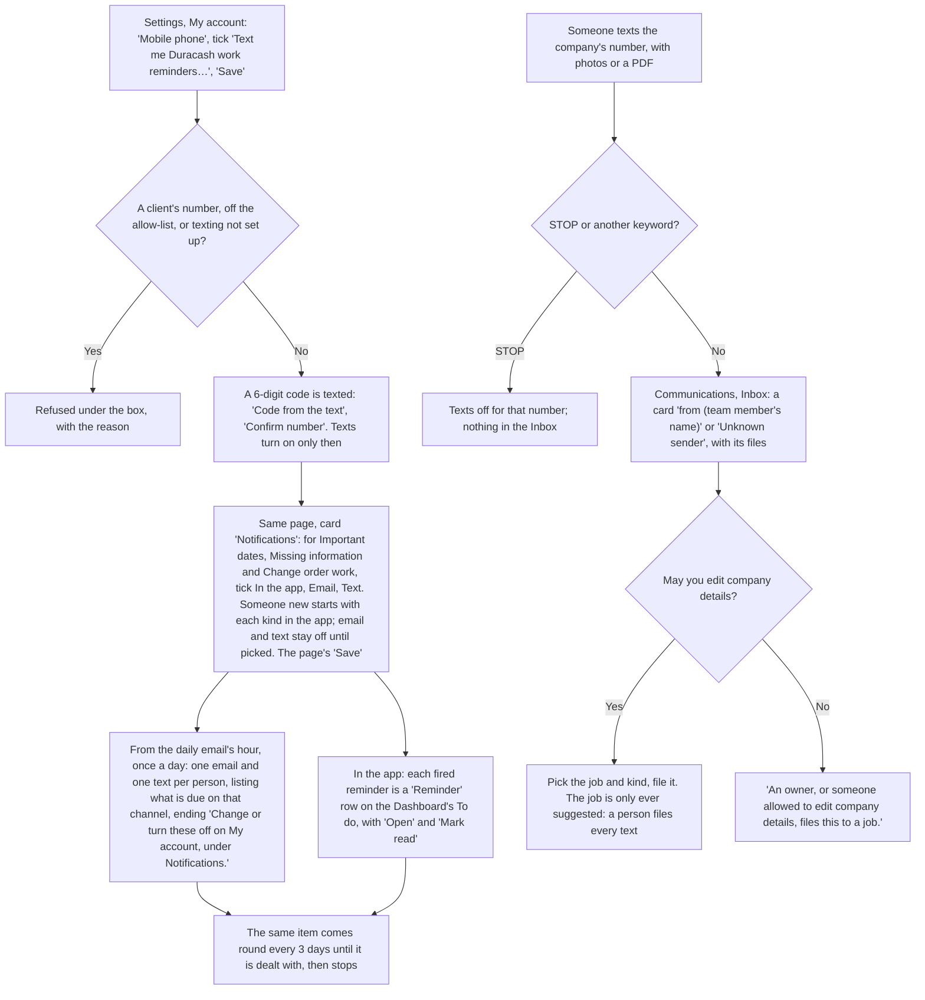
```mermaid
flowchart TD
    A["Settings, My account: 'Mobile phone', tick 'Text me Duracash work reminders…', 'Save'"] --> B{"A client's number, off the allow-list, or texting not set up?"}
    B -->|"Yes"| B1["Refused under the box, with the reason"]
    B -->|"No"| C["A 6-digit code is texted: 'Code from the text', 'Confirm number'. Texts turn on only then"]
    C --> D["Same page, card 'Notifications': for Important dates, Missing information and Change order work, tick In the app, Email, Text. Someone new starts with each kind in the app; email and text stay off until picked. The page's 'Save'"]
    D --> E["From the daily email's hour, once a day: one email and one text per person, listing what is due on that channel, ending 'Change or turn these off on My account, under Notifications.'"]
    D --> F["In the app: each fired reminder is a 'Reminder' row on the Dashboard's To do, with 'Open' and 'Mark read'"]
    E --> G["The same item comes round every 3 days until it is dealt with, then stops"]
    F --> G
    T["Someone texts the company's number, with photos or a PDF"] --> T0{"STOP or another keyword?"}
    T0 -->|"STOP"| T1["Texts off for that number; nothing in the Inbox"]
    T0 -->|"No"| T2["Communications, Inbox: a card 'from (team member's name)' or 'Unknown sender', with its files"]
    T2 --> T3{"May you edit company details?"}
    T3 -->|"Yes"| T4["Pick the job and kind, file it. The job is only ever suggested: a person files every text"]
    T3 -->|"No"| T5["'An owner, or someone allowed to edit company details, files this to a job.'"]
```

Allow-lists and staging: `mailer.allowed`, mailer.py:87, and `sms.allowed`, sms.py:112. `MAIL_ALLOWLIST` and `SMS_ALLOWLIST` name who may get anything. With `DURACASH_ENV=staging` (the `duracash-staging` service in render.yaml) a blank list sends to nobody; with a mail list in force and a blank text list, no text goes. An email held this way stays in the Outbox as "not sent: this address isn't on this server's allow-list", and **Send again** sends it once the address is listed. A person off the list gets no confirmation link and signs in without an emailed code, outside production. Staging has no disk, so its data and its counts reset on each deploy. Accounts and live tests: docs/setup-integrations.md.

Outgoing texts: sms.py has one way to send, `send_to_member`, sms.py:296, which takes a user id, never a number. A client's number is refused in any format, matched on its 10 digits (`client_numbers` sms.py:133), when a person saves it, when a code goes and at every send. **My account**: `textsHtml` static/js/views/settings.js:307, `_p_my_sms` server.py:2887 and `_p_my_sms_confirm` server.py:2925; the code `send_code` sms.py:316 lasts 15 minutes, and **Send a new code** (`sms-resend`, static/js/views/settings.js:611) asks for another. At most five codes an hour go to one person or one number (`issue_sms_code` auth.py:303); that is checked before the earlier code is dropped, so the one in hand stays live, and the refusal says which number got none and which has the newest code. One-word STOP turns texts off for every account with that number (`opt_out` sms.py:128); after that a person texts START first, then ticks the box again, and My account says so with the number to text. A code asked for before START is refused, and the refusal says to text START first. Someone who agreed before codes existed sees **Confirm your number to keep getting texts**. At most `SMS_DAILY_LIMIT` (20) a company a day, and none from a read-only company. Twilio's inbound post is checked by signature; production and staging refuse it without the token.

Inbound texts: `_inbound_sms`, server.py:2716. Files come down with `twilio_media.download`; a sender found by `auth.member_by_phone` reads by name, anyone else as **Unknown sender**, and the job match only ever suggests. Filing one needs the permission to edit company details (`by_text`, server.py:2773, drawn by `inboxItemCard` static/js/views/inbox.js:292). **Delivery ticket** and **Time sheet** are separate choices when filing (section 5).

Reminders: reminders.py. The kinds `KINDS` reminders.py:54: **Important dates** (`_date_items` reminders.py:103: a follow-up or payment date in the next 7 days or past, a pay app due day in the next 7 days, an anticipated end date in the next 7 days), **Missing information** (`_missing_items` reminders.py:128: a client on an open job with no billing email or phone, a pay app held up), **Change order work** (`_co_items` reminders.py:143: a job record in the last 30 days with change order work whose change order isn't signed, or on time and materials has no hours or backup; or work no change order covers yet). Who gets what follows the daily email (`for_person` reminders.py:199). The choices are the **Notifications** card on Settings, My account (`notificationsCardHtml`, static/js/views/automations.js:77; Round 1, item 19: once a page of its own, Automations, and `/automations` now opens My account there), saved with that page's one **Save** (`saveReminderPrefs`); ticking Text without a confirmed number is refused (`_p_reminder_prefs` server.py:2946). Someone new, by sign-up or invite, starts with every kind in the app (`NEW_USER_REMINDERS` auth.py:409); email and text stay off until picked, and accounts from before keep their choices. `REMINDER_REPEAT_DAYS` sets the interval, default 3. Email and text go from the hourly loop, `run` reminders.py:332, at most one message per person per channel per day, from `DAILY_EMAIL_HOUR_UTC`; a text fits 280 characters and says how many more are on My account (`text_message` reminders.py:214), and the email ends by pointing there. In the app, `sync_notifications` reminders.py:396 adds what is due whenever the person loads the app and marks done what has been dealt with; what fired and isn't read is a **Reminder** row on the Dashboard's To do (`reminderItems` static/js/views/automations.js:40, section 14), where **Open** reads it and goes to it.

Timing: `first_wait`, monthly.py:239. Nothing goes at start-up; the first run is about 5 minutes after boot (`BOOT_QUIET_SECONDS`, monthly.py:34), then hourly, so a server restarted often still gets its runs. What was done for the day is kept on disk, so a restart repeats nothing. Daily and monthly emails go at most once per person (`_send_once`, monthly.py:73): each address is written down before it is handed to the mailer and each company is saved as it finishes. After a kill, the people not reached yet still get theirs, the one address in hand may go without, and the alert says so. A record of what was sent that can't be read or isn't the right shape stops those emails, with an alert and a copy kept beside it, rather than risk sending twice (`_read_done`, monthly.py:55), as the reminders' file does. A company that is read-only is skipped (`billing.read_only_why`). A file of counts or places that can't be read means nothing is sent, the server alerts, and a copy is kept. The weekly part of the daily email is in section 14.

---

## Flows not charted, or charted with less confidence

- **Billing** (Settings, Billing: **Subscribe** / **Manage billing** through Stripe, `billingView` static/js/views/settings.js:394): shows only when Stripe is set up on the server; people whose profile doesn't include billing see it read-only.
- **The client's page** (`payer_page.render`, payer_page.py:152; wireframe `PayerPage`): This job (the pay app's lines 1-9 and the prior payments received, `_job_card` :75), the continuation sheet with Qty to date (`_sheet` :90), Mark as received, Approve for payment with a date, Send a question (an Inbox item for the contractor). Charted as branches in section 9.
- **QuickBooks connection** (**Connect QuickBooks**, Settings, Company and Import/Export, Import): the Intuit sign-in in the middle happens off our site. Charted as one branch in section 10.
- **Email forwarding and sharing from the phone into the Inbox** (`views.inbox`, **Bring emails and texts in automatically**): need an owner to set up an email service. Texts in are in section 18. Shared while signed out, files wait 30 minutes for sign-in (**Finish adding N shared items**, `heldShareHtml` static/js/views/auth.js:383).
- **Export** (Import/Export, Export: `views.export` static/js/views/data.js:127): **Download everything** (owners only; the server refuses members, `_g_export`), **Lists for a spreadsheet (CSV)** (I1, `export-lists` static/js/views/data.js:139): **Jobs**, **Pay apps**, **Payments** and **Change orders**, finished jobs included, for everyone signed in like Sent pay apps (`GET /api/export/<kind>.csv`, `_g_export_csv` server.py:1442, built by exports.py: `jobs_rows` exports.py:55 with client, address, contract, billed, received, outstanding, retainage held and still owed, status, started, done and finished; `payapps_rows` :85 without deleted drafts; `payments_rows` :102 with retainage released; `change_orders_rows` :123; every text cell through `text` :27, an apostrophe before = + - @ so a spreadsheet never runs it, dollars from whole cents by `dollars` :34), **Sent pay apps** with each one's **PDF** and **Download for QuickBooks**, filtered by job (`GET /api/payapps/sent`, `_g_sent_payapps` server.py:1278, `domain.sent_payapps_page` domain/comms.py:99; closed jobs' too), the **Calendar feed** with **Copy** (`calendarFeedHtml` static/js/views/inbox.js:132), and links to the Outbox and the Activity log. Settings, Company, **Your data** links here and keeps Reset and Delete.
- **Outbox** (Communications, Outbox: `views.outbox` static/js/views/communications.js:58-78): each email lists what it carried, **Pay app PDF** and each file by name, opening it, or "A file no longer on the job records" (`attachmentsHtml` :20); **Print** (`print-email` :86) prints that one email (To, When, Status, Subject, the message and its attachments) through `printSheet` :41 and the `@media print` rule in static/styles.css (comms-data block), black on white even from dark mode (D7, the `--print-` tokens). **Print** on an Everything received row does the same for something that came in.
- **Import quantities** (on the job's Schedule of values card since Round 1, item 19, once Import/Export's Quantities done; M1: quantities from the contractor's own records; `qtyImportForJob` static/js/views/data.js:76, `qtyImportHtml` static/js/views/data.js:47, for that job when it has a schedule of values, `qtyJobs` static/js/views/data.js:41): **Choose the file** (CSV or Excel, `qty-choose-file` static/js/views/data.js:186) or rows pasted and **Read quantities** (`qty-read` static/js/views/data.js:180). `POST /api/import/quantities/preview` (`_p_qty_preview` server.py:1893) changes nothing: `qty_import.parse` qty_import.py:125 takes columns by their header (item number, description, quantity this period) or, without one, a leading item number, the words and the last number; `qty_import.preview` qty_import.py:276 matches each row to a schedule line by item number, else by description in any case and punctuation (`_match` qty_import.py:188; a description that fits more than one line asks for the item number), reads a lump sum as the % done this period, and shows the line, Done to date, Add, New total, Scheduled and why a row can't be added. A job that can't take quantities now says why (`quantities_blocked` domain/daily.py:534). **Add N to the schedule of values** (`qty-apply` static/js/views/data.js:211) sends the same file again to `POST /api/import/quantities/apply` (`qty_import.apply` qty_import.py:312, with the preview's `basis`, so a preview tapped twice or one the schedule moved on from is refused: "Read the file again"): the rows that can be added go on the lines' field totals as a job record's quantities do, so no draft is made or changed (section 4); the rest are listed under **Not added**, in the activity log and in a job record note "Quantities imported from (file)". That record has **Undo import**. Who may record progress may import.
- **Draft for the client's review** (**Send draft for their review**, **Client agreed to the draft**, **Client wants changes**, static/js/jobs.js:96-98): an optional side path before send.
- **Tap counts** are the fewest taps on the happy path with fields already filled, counted from the code, not timed with a user. Confirms count as a tap.

---

## Limits and open questions

Not built:

- **A live link to a contractor's own system.** Quantities come from a New job record or an imported file (**Import quantities** on the schedule card), not a feed from a field or accounting program.
- **Other states' waiver notes.** Only Georgia's forms and notes are listed (`helper/waiver_forms.json`).
- **OCR and calendar controls.** Reading scanned documents, and choosing what goes onto Outlook, Google or Apple calendars and how, both wait on decisions. Today nothing on a scan or photo is compared: it is in on the word of the person who added it ("Photo added by"), and the calendar feed is one list for the company.
- **A credit pay app.** A signed credit can leave a job overbilled; it is settled by pulling the pay app back, or with **Record refund or credit**.
- **One Twilio number per company.** A number has one webhook, so one number files inbound texts to one company. Outgoing reminders can share a number.

Open questions for Stephen:

- What does "PE" mean in your note on public jobs, and what must be notarized or stamped, and by whom? **Notarized pay application** is a plain document item until that's settled.
- What did you mean by "Government contracting services"?
- Do the signer or the billing email ever vary per job? They are per client today; only the supporting documents list can differ per job.
- Partial payments: which waiver goes, and is one needed for each? Today a waiver comes due only once a pay app is paid in full or a short pay is accepted.
- Should a pay app ever need a second approver before it goes?
- Who is the "manager" who files texts? Today it is anyone whose profile may edit company details.
- Georgia's waiver wording needs an attorney's look before anyone relies on what the document check says about it.
- Should missing closeout documents stop Finish job? Today they are a warning and a confirm (section 13).
- A conditional waiver on a final draft counts as progress while an earlier pay app is unpaid (`_name_conditional_waiver`, domain/__init__.py:4416), since a waiver on final payment gives up what else is unpaid. Is that right? It is a legal call.
- The job card's arithmetic after a refund: Billed less Received no longer equals Outstanding once money has gone back, because Outstanding counts only what is still owed. Is the **Refunded or credited** row enough, or should the card read differently?
- A pay app holding retainage the client has paid can't be pulled back (`void_sent_pay_app`, domain/__init__.py:3861), so money is never left released with nothing held. Is that the right way out, or should a release be correctable?
- A credit taken off the retainage has no undo. Only a signed change order brings it back (section 12). Should there be one?
- The continuation sheet's Previous column: after a typed amount that doesn't land on a whole quantity, then stored materials, the next sheet's Previous can be slightly under the last sheet ($5.41 in the case found). Totals are right, and tests/test_money_fuzz.py allows it. Fix it, or leave it?
